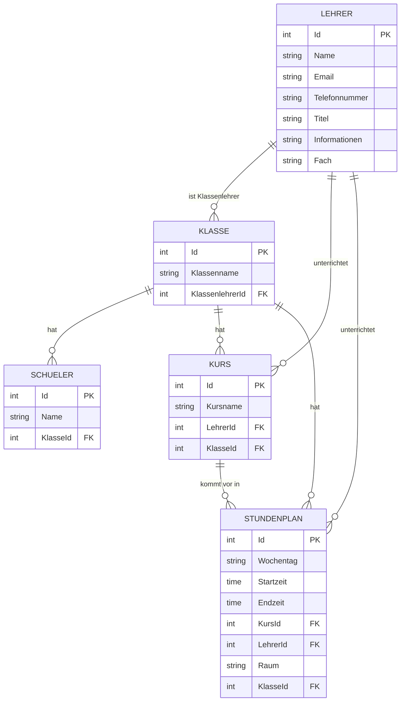

# SchulApp

SchulApp ist eine Schulverwaltungsanwendung, die mit **C#**, **.NET** und **Windows Forms** entwickelt wurde.

Die Anwendung dient dazu, wichtige Schuldaten wie **Schüler, Lehrer, Klassen, Kurse und Stundenpläne** zentral und übersichtlich zu verwalten. Die Daten werden in einer lokalen **Microsoft SQL Server 2022** Datenbank gespeichert. Für den Datenbankzugriff wird in mehreren Bereichen **Entity Framework Core** verwendet.

## Inhaltsverzeichnis

- [Funktionen](#funktionen)
- [Programmstart](#programmstart)
- [Login](#login)
- [Zusätzliche Erweiterungen](#zusätzliche-erweiterungen)
- [Verwaltete Daten](#verwaltete-daten)
- [Datenbank und Entity Framework Core](#datenbank-und-entity-framework-core)
- [Benutzeroberfläche](#benutzeroberfläche)
- [CRUD-Funktionen](#crud-funktionen)
- [Technologien](#technologien)
- [Projektstruktur](#projektstruktur)
- [Setup](#setup)
- [App-Demo](#app-demo)
- [Unit-Tests](#unit-tests)
- [Definition of Done](#definition-of-done)

## Funktionen

Zu den wichtigsten Funktionen der Anwendung gehören:

- Schüler anzeigen, erstellen, bearbeiten und löschen
- Schüler einer Klasse zuweisen
- Schüler übersichtlich in einer `DataGridView` Tabelle anzeigen
- Lehrer anzeigen, erstellen, bearbeiten und löschen
- Informationen, Fach, E-Mail und Telefonnummer zu Lehrern speichern
- Klassen anzeigen, erstellen, bearbeiten und löschen
- Schüler Klassen zuordnen
- Klassenlehrer einer Klasse zuweisen
- Kurse anzeigen, erstellen, bearbeiten und löschen
- Lehrer einem Kurs zuordnen
- Klassen einem Kurs zuordnen
- Stundenplaneinträge anzeigen, erstellen, bearbeiten und löschen
- Wochentag, Startzeit und Endzeit eines Stundenplaneintrags verwalten
- Kurs, Klasse, Lehrer und Raum eines Stundenplaneintrags anzeigen
- Stundenplaneinträge nach Wochentag und Uhrzeit sortiert darstellen
- Aktuelles Datum und aktuelle Uhrzeit anzeigen
- Löschen von Datensätzen vor dem Ausführen bestätigen
- Verknüpfte Daten wie Lehrer, Klassen, Schüler und Kurse gemeinsam darstellen
- Einstellungen für Hintergrund- und Textfarbe speichern
- Eigenes App-Icon für die Windows-Forms-Fenster verwenden

## Programmstart

Beim Start der Anwendung wird zuerst ein eigener **LoadingScreen** angezeigt.

Der Startvorgang läuft vereinfacht folgendermassen ab:

1. Die Anwendung wird initialisiert.
2. Die lokale `.env` Datei wird geladen.
3. Der LoadingScreen wird angezeigt.
4. Die Verbindung zur SQL-Datenbank wird über Entity Framework Core geprüft.
5. Bei erfolgreicher Datenbankverbindung wird der Startvorgang fortgesetzt.
6. Anschliessend wird das Login angezeigt.
7. Erst nach erfolgreichem Login wird die eigentliche Anwendung geöffnet.
8. Die gespeicherten Design-Einstellungen werden geladen und auf die Anwendung angewendet.

Kann keine Verbindung zur Datenbank hergestellt werden, wird eine Fehlermeldung angezeigt und der Startvorgang beendet.

## Login

Die Anwendung verfügt über ein eigenes **Admin-Login mit Benutzername und Passwort**.

Die Zugangsdaten werden lokal über eine `.env` Datei geladen. Dadurch müssen persönliche Zugangsdaten nicht direkt im Quellcode eingetragen werden.

Beispiel:

```env
ADMIN_USERNAME=Admin
ADMIN_PASSWORD=hier_dein_passwort
```

Für den Passwortvergleich wird **BCrypt** verwendet. Das Passwort wird von der Anwendung mit BCrypt verarbeitet.

Die lokale `.env` Datei enthält persönliche Einstellungen beziehungsweise Zugangsdaten und sollte deshalb nicht auf GitHub hochgeladen werden. Im Repository kann stattdessen eine `.env.example` Datei als Vorlage verwendet werden.

Die vollständige Einrichtung ist in [SETUP.md](SETUP.md) beschrieben.

## Zusätzliche Erweiterungen

Die ursprünglich geplanten Anforderungen des Projekts konnten frühzeitig fertiggestellt werden. Deshalb wurde die Anwendung anschliessend freiwillig um zusätzliche Funktionen erweitert, die über den ursprünglich geplanten Umfang hinausgehen.

Zu diesen Erweiterungen gehören:

- Eigenes Login-System
- Laden der Zugangsdaten aus einer `.env` Datei
- Passwortverarbeitung mit BCrypt
- Eigener Loading- beziehungsweise Splashscreen beim Programmstart
- Automatische Prüfung der SQL-Datenbankverbindung beim Start
- Datenbankprüfung über `Database.CanConnectAsync()` von Entity Framework Core
- Eigene Einstellungsseite für die Darstellung der Anwendung
- Frei wählbare Hintergrundfarbe über einen `ColorDialog`
- Frei wählbare Textfarbe über einen `ColorDialog`
- Prüfung, dass Hintergrundfarbe und Textfarbe nicht identisch sein können
- Zentraler `ThemeManager` für die Darstellung der Anwendung
- Speicherung der gewählten Hintergrund- und Textfarbe in der SQL-Datenbank
- Automatisches Laden des zuletzt verwendeten Designs
- Sofortige Aktualisierung des Designs bei bereits geöffneten Fenstern
- Möglichkeit, das Design auf die Standardfarben zurückzusetzen
- Anzeige von aktuellem Datum und aktueller Uhrzeit im Stundenplan
- Verwendung eigener Bilder aus dem `images` Ordner
- Verwendung eines eigenen App-Icons
- Einführung von Entity Framework Core für mehrere Datenbankzugriffe
- Zentraler Datenbankkontext über `SchulAppContext`
- Abbildung der SQL-Tabellen als C# Models
- Beziehungen zwischen Schülern, Lehrern, Klassen, Kursen und Stundenplaneinträgen
- Reduzierung von direkt geschriebenen `SELECT`, `INSERT`, `UPDATE` und `DELETE` SQL-Abfragen
- Verwendung von LINQ und `SaveChanges()` für Datenbankoperationen

Diese Funktionen waren nicht Bestandteil der ursprünglichen Anforderungen und wurden zusätzlich umgesetzt, da die geplanten Aufgaben bereits früher abgeschlossen waren.

## Verwaltete Daten

## Entity-Relationship-Diagramm

Das folgende ERD zeigt die wichtigsten Tabellen und Beziehungen der SchulApp.


### Beziehungen kurz erklärt

- Eine **Klasse** kann mehrere **Schüler** haben.
- Ein **Schüler** gehört zu einer Klasse.
- Ein **Lehrer** kann Klassenlehrer von einer oder mehreren Klassen sein.
- Ein **Lehrer** kann mehrere Kurse unterrichten.
- Eine **Klasse** kann mehrere Kurse haben.
- Ein **Kurs** kann mehrere Stundenplaneinträge besitzen.
- Ein **Stundenplaneintrag** gehört zu einem Kurs, einem Lehrer und einer Klasse.

### Einstellungen

Für die Darstellung der Anwendung können unter anderem folgende Einstellungen gespeichert werden:

- Hintergrundfarbe
- Textfarbe

## Datenbank und Entity Framework Core

Die Daten der Anwendung werden in einer lokalen **Microsoft SQL Server 2022** Datenbank gespeichert.

Für mehrere Datenbankzugriffe wird **Entity Framework Core** verwendet. Dadurch können Daten direkt über C# Models und LINQ verarbeitet werden, ohne jede SQL-Abfrage vollständig von Hand schreiben zu müssen.

Der zentrale Datenbankkontext ist `SchulAppContext`. Dieser erbt von `DbContext` und stellt die Tabellen der Anwendung über `DbSet` zur Verfügung.

Beispiel zum Laden von Daten:

```csharp
using SchulAppContext context = new SchulAppContext();

var klassen = context.Klassen.ToList();
```

Beispiel zum Speichern eines neuen Datensatzes:

```csharp
context.Klassen.Add(neueKlasse);
context.SaveChanges();
```

Die Datenbankverbindung wird ausserdem beim Start der Anwendung geprüft:

```csharp
bool verbunden = await context.Database.CanConnectAsync();
```

Kann keine Verbindung hergestellt werden, wird der Benutzer über eine Fehlermeldung informiert.

Die SQL-Tabellen werden unter anderem durch folgende Models dargestellt:

- `Einstellung`
- `SchuelerModel`
- `LehrerModel`
- `KlasseModel`
- `KursModel`
- `StundenplanModel`

Zwischen den Models bestehen Beziehungen. Dadurch können beispielsweise bei einem Kurs direkt die zugehörige Klasse und der zugehörige Lehrer geladen werden.

## Benutzeroberfläche

Die grafische Benutzeroberfläche wird mit **Windows Forms** umgesetzt.

Dabei werden unter anderem folgende Steuerelemente verwendet:

- `Label`
- `TextBox`
- `ComboBox`
- `Button`
- `DataGridView`
- `PictureBox`
- `ProgressBar`
- `ColorDialog`
- `DateTimePicker`

Die Anwendung ist in mehrere eigene Ansichten aufgeteilt:

- LoadingScreen
- Login
- Hauptmenü
- Schüler
- Lehrer
- Klassen
- Kurse
- Stundenplan
- Einstellungen

## CRUD-Funktionen

Die Anwendung verwendet CRUD-Operationen zur Verwaltung der Schuldaten.

| Operation | Bedeutung |
|---|---|
| Create | Neue Daten erstellen |
| Read | Gespeicherte Daten anzeigen |
| Update | Bestehende Daten bearbeiten |
| Delete | Daten löschen |

Mit Entity Framework Core können diese Operationen unter anderem über folgende Funktionen umgesetzt werden:

- `Add()` zum Hinzufügen neuer Datensätze
- LINQ zum Laden und Filtern von Daten
- Änderungen an Model-Eigenschaften zum Bearbeiten
- `Remove()` zum Löschen
- `SaveChanges()` beziehungsweise `SaveChangesAsync()` zum Speichern

## Technologien

Für die Entwicklung werden folgende Technologien und Werkzeuge verwendet:

- C#
- .NET
- Windows Forms
- Visual Studio 2022
- Microsoft SQL Server 2022
- Entity Framework Core
- Microsoft Entity Framework Core SQL Server Provider
- Microsoft.Data.SqlClient
- BCrypt
- DotNetEnv
- Git
- GitHub
- GitLab

### NuGet-Pakete

Unter anderem werden folgende NuGet-Pakete beziehungsweise Bibliotheken verwendet:

```text
Microsoft.EntityFrameworkCore.SqlServer
Microsoft.EntityFrameworkCore.Tools
Microsoft.Data.SqlClient
DotNetEnv
BCrypt.Net
```

## Projektstruktur

Eine vereinfachte Projektstruktur sieht folgendermassen aus:

```text
SchulApp
│
├── Data
│   └── SchulAppContext.cs
│
├── Models
│   ├── Einstellung.cs
│   ├── SchuelerModel.cs
│   ├── LehrerModel.cs
│   ├── KlasseModel.cs
│   ├── KursModel.cs
│   └── StundenplanModel.cs
│
├── Services
│
├── images
│
├── Screenshots
│   └── README.md
│
├── .env.example
├── SETUP.md
├── Login.cs
├── LoadingScreen.cs
├── Hauptmenue.cs
├── Schueler.cs
├── Lehrer.cs
├── Klassen.cs
├── Kurse.cs
├── Stundenplan.cs
├── Einstellungen.cs
├── ThemeManager.cs
└── Program.cs
```

Die wichtigsten Bereiche haben folgende Aufgaben:

- `Data` enthält den Entity Framework Datenbankkontext.
- `Models` enthalten die C# Abbildungen der Datenbanktabellen und deren Beziehungen.
- `Services` können zusätzliche Programmlogik und Datenzugriffe enthalten.
- Die Windows Forms Dateien enthalten die grafische Benutzeroberfläche und deren Ereignisse.
- `ThemeManager` verwaltet die Darstellung der Anwendung zentral.
- `Login` übernimmt die Anmeldung des Administrators.
- `LoadingScreen` zeigt den Startvorgang an und prüft die Datenbankverbindung.
- `images` enthält Bilder und Icons der Anwendung.
- `Screenshots` enthält Bilder für die Dokumentation.

## Setup

Vor dem ersten Start müssen die lokalen Einstellungen eingerichtet werden.

Die wichtigsten Schritte sind:

1. `.env.example` kopieren und als `.env` speichern.
2. Admin-Benutzername und Admin-Passwort in `.env` eintragen.
3. Sicherstellen, dass Microsoft SQL Server läuft und die benötigte Datenbank vorhanden ist.
4. Anwendung über Visual Studio starten.

Beispiel zum Erstellen der `.env` Datei mit PowerShell:

```powershell
copy .env.example .env
```

Weitere Informationen befinden sich in [SETUP.md](SETUP.md).

## App-Demo

Im Ordner `Screenshots` befindet sich ein eigenes README, das die verschiedenen Seiten und Funktionen der Anwendung mit Bildern zeigt.

[Screenshots öffnen](Screenshots/README.md)

## Unit-Tests

Für das Projekt werden mindestens drei Unit-Tests verwendet beziehungsweise vorgesehen, um wichtige CRUD-Funktionen zu überprüfen.

### Daten erstellen

Es wird überprüft, ob ein neuer Schüler korrekt erstellt und gespeichert werden kann.

### Daten bearbeiten

Es wird überprüft, ob die Daten eines bestehenden Schülers geändert und korrekt gespeichert werden können.

### Daten löschen

Es wird überprüft, ob ein Schüler korrekt gelöscht wird und danach nicht mehr vorhanden ist.

## Definition of Done

Das Projekt gilt als abgeschlossen, wenn:

- die Windows Forms Anwendung funktioniert
- der LoadingScreen beim Start angezeigt wird
- die Datenbankverbindung beim Start geprüft wird
- das Login funktioniert
- die Anwendung erst nach erfolgreicher Anmeldung geöffnet wird
- Lehrer verwaltet werden können
- Schüler verwaltet werden können
- Klassen verwaltet werden können
- Kurse verwaltet werden können
- Stundenplaneinträge verwaltet werden können
- Daten erstellt werden können
- Daten angezeigt werden können
- Daten bearbeitet werden können
- Daten gelöscht werden können
- die Daten korrekt in Microsoft SQL Server gespeichert werden
- Entity Framework Core für die vorgesehenen Datenbankzugriffe funktioniert
- die Einstellungen gespeichert und beim Start geladen werden
- Hintergrund- und Textfarbe nicht identisch gewählt werden können
- die Anwendung ohne Fehler startet
- mindestens drei Unit-Tests vorhanden sind
- das Erstellen von Daten getestet wird
- das Bearbeiten von Daten getestet wird
- das Löschen von Daten getestet wird
- alle Unit-Tests erfolgreich durchlaufen
