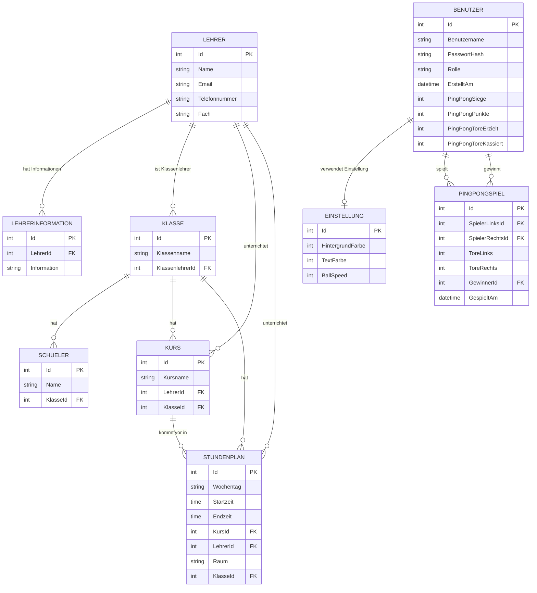

# SchulApp

SchulApp ist eine Schulverwaltungsanwendung mit **C#**, **.NET 10** und **Windows Forms**.

Die Anwendung verwaltet zentrale Schuldaten wie **Schüler, Lehrer, Klassen, Kurse und Stundenpläne**. Die Daten werden in einer lokalen **Microsoft SQL Server 2022** Datenbank gespeichert und über **Entity Framework Core** verarbeitet.

Zusätzlich enthält das Projekt ein eigenes Login- und Registrierungssystem mit Rollen und Berechtigungen, benutzerspezifische Design-Einstellungen inklusive PingPong-Ballgeschwindigkeit, Profilbilder, eine REST API mit Swagger und Health Check, eine SOAP API mit CoreWCF, automatisierte xUnit-Tests, GitHub Actions sowie Prometheus- und Grafana-Monitoring.

## Inhaltsverzeichnis

- [Funktionen](#funktionen)
- [Programmstart](#programmstart)
- [Login und Registrierung](#login-und-registrierung)
- [Rollen und Berechtigungen](#rollen-und-berechtigungen)
- [PingPong](#pingpong)
- [Bestenliste](#bestenliste)
- [REST API](#rest-api)
- [Health Check](#health-check)
- [SOAP API](#soap-api)
- [Monitoring](#monitoring)
- [REST API mit Postman testen](#rest-api-mit-postman-testen)
- [Verwaltete Daten](#verwaltete-daten)
- [Datenbank und Entity Framework Core](#datenbank-und-entity-framework-core)
- [Architektur und Service-Schicht](#architektur-und-service-schicht)
- [Theme-Management](#theme-management)
- [Benutzeroberfläche](#benutzeroberfläche)
- [CRUD-Funktionen](#crud-funktionen)
- [Datenvalidierung und Abhängigkeiten](#datenvalidierung-und-abhängigkeiten)
- [Technologien](#technologien)
- [Projektstruktur](#projektstruktur)
- [Setup](#setup)
- [Unit-Tests](#unit-tests)
- [GitHub Actions](#github-actions)
- [Definition of Done](#definition-of-done)

## Funktionen

Zu den wichtigsten Funktionen der Anwendung gehören:

- Schüler anzeigen, erstellen, bearbeiten und löschen
- Schüler einer Klasse zuweisen
- Schüler in einer `DataGridView` Tabelle anzeigen
- Lehrer anzeigen, erstellen, bearbeiten und löschen
- Informationen, Fach, E-Mail und Telefonnummer zu Lehrern speichern
- Zusätzliche Lehrerinformationen separat speichern und verwalten
- Klassen anzeigen, erstellen, bearbeiten und löschen
- Schüler Klassen zuordnen
- Klassenlehrer einer Klasse zuweisen
- Anzahl der zugeordneten Schüler in der Klassenübersicht anzeigen
- Kurse anzeigen, erstellen, bearbeiten und löschen
- Lehrer einem Kurs zuordnen
- Klassen einem Kurs zuordnen
- Stundenplaneinträge anzeigen, erstellen, bearbeiten und löschen
- Wochentag, Startzeit und Endzeit eines Stundenplaneintrags verwalten
- Kurs, Klasse, Lehrer, Raum und Zeit im Stundenplan darstellen
- Stundenplaneinträge nach Wochentag und Uhrzeit sortieren
- Prüfen, dass die Endzeit nach der Startzeit liegt
- Aktuelles Datum und aktuelle Uhrzeit anzeigen
- Löschen von Datensätzen vor dem Ausführen bestätigen
- Abhängige Datensätze vor ungültigem Löschen schützen
- Benutzer über Login anmelden
- Neue Benutzer über eine Registrierungsseite erstellen
- Rollenabhängige Zugriffsrechte anwenden
- Passwörter mit BCrypt hashen und prüfen
- Profilbilder pro Benutzer anzeigen
- Design-Einstellungen pro Benutzer speichern
- PingPong zwischen zwei vorhandenen Benutzern spielen
- PingPong-Spiele bis 5 Punkte durchführen
- Laufende PingPong-Spiele über `Q` oder beim Minimieren pausieren
- Spielergebnisse über die REST API speichern
- Eine REST-basierte Bestenliste anzeigen
- Schülerdaten über eine SOAP API laden
- Schüler über die SOAP API löschen
- SOAP-Funktionen über eine WSDL beschreiben und als WCF Web Service Reference in der WinForms-App verwenden
- REST API über Swagger dokumentieren und testen
- Gesundheitsstatus von REST API, SOAP API und Datenbank über `/health` prüfen
- REST- und SOAP-Metriken über `/metrics` für Prometheus bereitstellen
- Prometheus und Grafana automatisch über Docker Compose starten
- REST API, SOAP API und Datenbankstatus in einem Grafana-Dashboard überwachen
- PingPong-Ballgeschwindigkeit zwischen 1 und 20 speichern
- Schüler-Service, REST-Controller und SOAP-Service mit xUnit testen
- Build und Tests bei Pushes und Pull Requests automatisch mit GitHub Actions ausführen

## Programmstart

Für den normalen Start müssen folgende Komponenten verfügbar sein:

- Microsoft SQL Server 2022 mit der Datenbank `SchulAppDB`
- .NET 10 SDK
- Docker Desktop mit Docker Compose

Beim ersten Einrichten des Projekts muss nur dieses SQL-Skript ausgeführt werden:

```text
SchulApp/SQL/SchulAppDB.sql
```

Das Skript richtet die benötigte Datenbankstruktur inklusive Benutzer, Profil, PingPong, Bestenliste und Ballgeschwindigkeit ein.

Danach wird die komplette Anwendung aus dem Hauptordner `SchulApp` mit einem einzigen Befehl gestartet:

```powershell
.\start.ps1
```

`start.ps1` führt den aktuellen Startablauf automatisch aus:

1. Docker und Docker Compose werden geprüft.
2. Prometheus und Grafana werden über `Monitoring/docker-compose.yml` gestartet.
3. Das Skript wartet auf Prometheus und Grafana.
4. `schulAppREST` und `SchulappSOAP` werden gestartet.
5. Das Skript wartet auf REST API und SOAP-WSDL.
6. Die REST- und SOAP-`/metrics`-Endpunkte werden geprüft.
7. Danach wird die WinForms-Anwendung `SchulApp` gestartet.
8. Der LoadingScreen prüft die SQL-Datenbankverbindung.
9. Nach erfolgreicher Prüfung wird das Login geöffnet.

Beim Beenden der WinForms-Anwendung beendet das Skript REST API, SOAP API, Prometheus und Grafana. Die Docker-Volumes bleiben bestehen, damit die Monitoring-Historie erhalten bleibt.

Wichtige lokale URLs:

| Dienst | URL |
|---|---|
| REST API Swagger | `https://localhost:63635/swagger` |
| REST API HTTP | `http://localhost:63636` |
| Health Check | `https://localhost:63635/health` |
| REST Metriken | `http://localhost:63636/metrics` |
| SOAP Service | `http://localhost:5210/SchuelerService.svc` |
| SOAP WSDL | `http://localhost:5210/SchuelerService.svc?wsdl` |
| SOAP Metriken | `http://localhost:5210/metrics` |
| Prometheus | `http://localhost:9090` |
| Grafana | `http://localhost:3000` |

Grafana verwendet lokal standardmässig:

```text
Benutzer: admin
Passwort: schulapp
```

## Login und Registrierung

Die Anwendung verfügt über ein eigenes Login mit Benutzername und Passwort.

Die Benutzerkonten werden in der SQL-Datenbank gespeichert. Passwörter werden nicht im Klartext abgelegt, sondern mit **BCrypt** gehasht.

Beim Login wird der eingegebene Benutzername in der Datenbank gesucht. Das eingegebene Passwort wird anschliessend gegen den gespeicherten BCrypt-Hash geprüft.

### Registrierung

Neue Benutzer können über eine eigene Registrierungsseite angelegt werden.

Bei der Registrierung wird zusätzlich eine Rolle ausgewählt:

- Admin
- Lehrer
- Schüler

Für die Registrierung gelten unter anderem folgende Validierungen:

- Benutzername muss mindestens 3 Zeichen lang sein
- Passwort muss mindestens 8 Zeichen lang sein
- Benutzername muss eindeutig sein
- Erforderliche Felder dürfen nicht leer sein
- Eine gültige Benutzerrolle muss ausgewählt sein

Der Benutzername, der Passwort-Hash und die Rolle werden anschliessend in der Datenbank gespeichert.

Beim Wechsel zwischen Login und Registrierung wird die Fensterposition beibehalten.

### `.env` Datei

Die Anwendung kann beim Start optional eine lokale `.env` Datei einlesen.

Benutzername und Passwort für das Login werden nicht aus der `.env` Datei geladen. Benutzerkonten werden über die Anwendung registriert und in der Datenbank gespeichert.

Für die REST API kann optional die Umgebungsvariable `SCHULAPP_API_BASE_URL` gesetzt werden. Ohne diese Variable verwendet der PingPong-Service standardmässig:

```text
https://localhost:63635/
```

Die vollständige Einrichtung ist in [SETUP.md](SETUP.md) beschrieben.

## Rollen und Berechtigungen

Die Anwendung unterscheidet zwischen den drei Benutzerrollen **Admin**, **Lehrer** und **Schüler**.

### Admin

Ein Admin besitzt vollständige Verwaltungsrechte und kann unter anderem:

- Schüler verwalten
- Lehrer verwalten
- Klassen verwalten
- Kurse verwalten
- Stundenplaneinträge verwalten
- Einstellungen verwenden und ändern
- Profil verwenden
- PingPong und Bestenliste öffnen

### Lehrer

Ein Lehrer kann:

- Schüler verwalten
- Stundenplaneinträge verwalten
- Einstellungen verwenden und ändern
- Profil verwenden
- PingPong und Bestenliste öffnen

Ein Lehrer kann keine Lehrer, Klassen oder Kurse verwalten.

### Schüler

Ein Schüler besitzt für die Schuldaten hauptsächlich Leserechte.

Ein Schüler kann:

- den Stundenplan anzeigen
- eigene Design-Einstellungen verwenden und ändern
- das eigene Profil verwenden
- PingPong und Bestenliste öffnen

### Abmelden

Über den **Abmelden**-Button im Hauptmenü kann die aktuelle Sitzung beendet werden. Anschliessend wird wieder das Login angezeigt.

## PingPong

Die Anwendung enthält ein einfaches Zwei-Spieler-PingPong-Spiel als zusätzliche Funktion.

### Spieler

Der linke Spieler ist immer der aktuell eingeloggte Benutzer.

Der rechte Spieler wird vor dem Spiel aus den vorhandenen Benutzern ausgewählt. Die Benutzer werden über die REST API geladen. Der aktuell angemeldete Benutzer wird nicht als eigener Gegner angeboten.

Für ein Spiel müssen deshalb mindestens zwei Benutzerkonten existieren.

### Steuerung

Linker Spieler:

```text
W = hoch
S = runter
```

Rechter Spieler:

```text
Pfeiltaste hoch = hoch
Pfeiltaste runter = runter
```

Pausenmenü:

```text
Q = Spiel pausieren
```

Im Pausenmenü kann das Spiel mit **Fortsetzen** weitergespielt oder über **Zurück zum Hauptmenü** verlassen werden.

Wird das Fenster während eines laufenden Spiels minimiert, wird das Spiel ebenfalls automatisch pausiert. Nach dem Wiederherstellen kann es über **Fortsetzen** weitergespielt werden.

### Spielfeld

Die obere Spielfeldgrenze wird durch `panelTop` definiert. Ball und Schläger können nicht oberhalb dieses Bereichs spielen.

Der Ball prallt an:

- `panelTop`
- der unteren Fenstergrenze
- `panelLinks`
- `panelRechts`

ab.

### Punktesystem im Spiel

Ein Spieler erhält einen Spielpunkt, wenn der Ball auf der Seite des Gegners das Spielfeld verlässt.

Ein Spiel endet, sobald ein Spieler **5 Punkte** erreicht.

Nach jedem normalen Punkt werden Ball und Schläger wieder auf ihre Startposition gesetzt und das Spiel wird fortgesetzt.

Der aktuelle Punktestand wird über `punkteZahlLabel` angezeigt.

### Ballgeschwindigkeit

Die Ballgeschwindigkeit kann in den **Einstellungen** konfiguriert werden.

- gültiger Bereich: `1` bis `20`
- Standardwert: `6`
- derselbe Wert wird für X- und Y-Geschwindigkeit verwendet
- die Einstellung wird über die REST API geladen und gespeichert
- falls die REST API beim Laden nicht erreichbar ist, verwendet PingPong den Standardwert `6`

Verwendete REST-Endpunkte:

```http
GET /api/Einstellung/{id}/ball-speed
PUT /api/Einstellung/{id}/ball-speed
```

### Spielende

Sobald ein Spieler 5 Punkte erreicht:

1. Der Timer wird gestoppt.
2. Der Gewinner wird angezeigt.
3. Das Endergebnis wird angezeigt.
4. Das Ergebnis wird über die REST API gespeichert.
5. Die Bestenlistenwerte werden aktualisiert.
6. Danach kann erneut gespielt oder zum Hauptmenü zurückgekehrt werden.

Bei **Erneut spielen** wird der Punktestand auf `0 : 0` zurückgesetzt und ein neues Spiel mit denselben ausgewählten Benutzern gestartet.

## Bestenliste

Die Anwendung enthält eine eigene `Bestenliste` Form.

Die Bestenliste lädt ihre Daten beim Öffnen automatisch über die REST API und zeigt pro Benutzer:

- Benutzername
- Siege
- Punkte
- erzielte Tore
- kassierte Tore
- Torverhältnis

Für jeden PingPong-Sieg erhält der Gewinner:

```text
1 Sieg
3 Punkte
```

Zusätzlich werden für beide Spieler die erzielten und kassierten Tore aktualisiert.

Das Torverhältnis wird berechnet als:

```text
erzielte Tore - kassierte Tore
```

Die Sortierung erfolgt in dieser Reihenfolge:

1. Punkte absteigend
2. Torverhältnis absteigend
3. erzielte Tore absteigend
4. Benutzername

Die Bestenliste wird nicht lokal in der WinForms-Anwendung gespeichert.

## REST API

Zum Projekt gehört die bestehende **schulAppREST** ASP.NET Core REST API.

Sie läuft lokal mit zwei Bindings:

```text
HTTPS: https://localhost:63635
HTTP:  http://localhost:63636
```

Der HTTP-Endpunkt bleibt insbesondere für Prometheus verfügbar. Normale Requests werden auf HTTPS umgeleitet, während `/metrics` absichtlich über HTTP erreichbar bleibt.

### Swagger

Im Development-Modus stellt die REST API eine Swagger-Oberfläche bereit:

```text
https://localhost:63635/swagger
```

Beim direkten Start des REST-Projekts ist `launchBrowser` aktiviert und öffnet automatisch die Swagger-Seite.

Die PingPong-Funktionen verwenden `PingPongApiService` in der WinForms-Anwendung, um mit dieser API zu kommunizieren.

### PingPong-Endpunkte

#### Bestenliste laden

```http
GET /api/PingPong/bestenliste
```

Der Endpoint liefert die aktuellen PingPong-Werte aller Benutzer.

#### Spiel speichern

```http
POST /api/PingPong/spiel
```

Ein Beispiel für den Request-Body:

```json
{
  "spielerLinksId": 1,
  "spielerRechtsId": 2,
  "toreLinks": 5,
  "toreRechts": 3
}
```

Die API prüft unter anderem:

- beide Benutzer müssen unterschiedlich sein
- beide Benutzer müssen existieren
- Tore müssen zwischen 0 und 5 liegen
- das Ergebnis darf nicht unentschieden sein
- genau ein Spieler muss 5 Punkte erreicht haben

Beim Speichern werden:

- das konkrete Spiel in `PingPongSpiel` gespeichert
- Siege aktualisiert
- Bestenlistenpunkte aktualisiert
- erzielte Tore aktualisiert
- kassierte Tore aktualisiert


## Health Check

Die REST API enthält einen eigenen Health-Check-Endpunkt:

```http
GET /health
```

Lokal ist er über folgende Adresse erreichbar:

```text
https://localhost:63635/health
```

Der Health Check prüft:

- ob die REST API selbst läuft
- ob `SchulAppDB` über Entity Framework Core erreichbar ist
- ob die SOAP-WSDL unter der konfigurierten `SoapApi:HealthUrl` erreichbar ist

Die SOAP-Adresse wird in `schulAppREST/appsettings.json` konfiguriert:

```json
{
  "SoapApi": {
    "HealthUrl": "http://localhost:5210/SchuelerService.svc?wsdl"
  }
}
```

Wenn alle Komponenten erreichbar sind, antwortet der Endpunkt mit HTTP `200` und `Healthy`. Wenn Datenbank oder SOAP API nicht erreichbar sind, liefert er HTTP `503` und `Unhealthy`. Die JSON-Antwort enthält zusätzlich einen UTC-Zeitstempel und den Status der einzelnen Komponenten.

## SOAP API

Zusätzlich zur REST API enthält das Projekt die **SchulappSOAP** API. Sie basiert auf **CoreWCF** und stellt SOAP-Dienste für die WinForms-Anwendung bereit.

Die SOAP API verwendet wie die restliche Anwendung die lokale Datenbank `SchulAppDB` und greift über **Entity Framework Core** auf die Schülerdaten zu.

### SOAP-Endpunkt

Der aktuelle lokale SOAP-Endpunkt lautet:

```text
http://localhost:5210/SchuelerService.svc
```

Die zugehörige WSDL ist erreichbar unter:

```text
http://localhost:5210/SchuelerService.svc?wsdl
```

WSDL steht für **Web Services Description Language**. Die WSDL beschreibt den SOAP-Service, seine Operationen, Parameter und Rückgabewerte in XML.

### Schüler-Service

Der SOAP-Vertrag wird über `ISchuelerService` definiert.

Aktuell stehen folgende Operationen zur Verfügung:

```text
GetSchueler
GetSchuelerById
DeleteSchueler
```

`[ServiceContract]` markiert das Interface als SOAP-Servicevertrag. `[OperationContract]` legt fest, welche Methoden über SOAP aufgerufen werden können.

Der Service wird in CoreWCF mit `BasicHttpBinding` veröffentlicht:

```csharp
app.UseServiceModel(serviceBuilder =>
{
    serviceBuilder
        .AddService<SchuelerService>()
        .AddServiceEndpoint<SchuelerService, ISchuelerService>(
            new BasicHttpBinding(),
            "/SchuelerService.svc"
        );
});
```

Die WSDL-Metadaten werden mit `AddServiceModelMetadata()` und `ServiceMetadataBehavior` aktiviert.

### Verwendung in der WinForms-Anwendung

Die WinForms-Anwendung verwendet eine **WCF Web Service Reference**, die aus der WSDL generiert wird.

Dadurch kann der SOAP-Service wie ein normaler C#-Client verwendet werden:

```csharp
var schueler = await soapClient.GetSchuelerAsync();
```

Aktueller Stand der Schülerverwaltung:

| Funktion | Zugriff |
|---|---|
| Schüler laden | SOAP |
| Schüler nach ID abrufen | SOAP-Service vorhanden |
| Schüler löschen | SOAP |
| Schüler erstellen | lokaler Service / Entity Framework |
| Schüler bearbeiten | lokaler Service / Entity Framework |
| Klassen laden | Entity Framework |

Die SOAP-Integration ist damit bereits aktiv, aber die Schülerverwaltung ist noch nicht vollständig auf SOAP umgestellt.

Der vereinfachte Datenfluss beim Laden von Schülern ist:

```text
SchulApp WinForms
    |
    v
WCF SOAP Client
    |
    v
SchulappSOAP
    |
    v
SchuelerService
    |
    v
Entity Framework Core
    |
    v
SQL Server / SchulAppDB
```

## Monitoring

SchulApp enthält ein lokales Monitoring mit **Prometheus** und **Grafana**.

Die Konfiguration liegt unter:

```text
Monitoring/
```

`start.ps1` startet das Monitoring automatisch über Docker Compose. Prometheus liest alle 5 Sekunden Metriken von:

```text
REST: http://host.docker.internal:63636/metrics
SOAP: http://host.docker.internal:5210/metrics
```

Das automatisch provisionierte Grafana-Dashboard zeigt unter anderem:

- Erreichbarkeit der REST API
- Erreichbarkeit der SOAP API
- Erreichbarkeit der Datenbank
- Anzahl REST- und SOAP-Requests
- HTTP-Fehler
- durchschnittliche Antwortzeiten
- Requests pro Minute
- zeitliche Verläufe für Antwortzeiten und Fehler

Prometheus speichert die Metriken bis zu 30 Tage im Docker-Volume. Grafana und Prometheus verwenden persistente Docker-Volumes.

Weitere Details stehen in [`Monitoring/README.md`](Monitoring/README.md).

## REST API mit Postman testen

Für einen vollständigen Test der REST API befindet sich im Hauptordner des Projekts eine vorbereitete Postman Collection:

```text
Postman/SchulAppRESTAPI.postman_collection.json
```

Die Collection ist dafür vorgesehen, als **gesamte Collection über den Postman Collection Runner** ausgeführt zu werden. Die enthaltenen Skripte prüfen automatisch, ob die Requests wie erwartet ausgeführt wurden.

### Voraussetzungen

Vor dem Test müssen folgende Voraussetzungen erfüllt sein:

1. Microsoft SQL Server läuft.
2. Die Datenbank `SchulAppDB` ist eingerichtet und erreichbar.
3. Die REST API läuft.

Am einfachsten wird die Anwendung wie gewohnt im Hauptordner gestartet:

```powershell
.\start.ps1
```

Dadurch wird zuerst `schulAppREST` gestartet. Die Postman Collection verwendet standardmässig folgende API-Adresse:

```text
https://localhost:63635/
```

### Collection in Postman importieren

1. Postman öffnen.
2. **Import** auswählen.
3. Die Datei `Postman/SchulAppRESTAPI.postman_collection.json` auswählen.
4. Die importierte Collection **SchulApp REST API - Sicher und vollständig** öffnen.

Die benötigten Collection-Variablen sind bereits in der Collection hinterlegt.

### Vollständigen API-Test ausführen

Die Requests sollten nicht einzeln in einer beliebigen Reihenfolge ausgeführt werden. Für den vollständigen Test wird die gesamte Collection über den Collection Runner gestartet:

1. Die Collection **SchulApp REST API - Sicher und vollständig** öffnen.
2. **Run collection** auswählen.
3. Alle Ordner und Requests aktiviert lassen.
4. Die Requests in der vorhandenen Reihenfolge ausführen.
5. Den Lauf starten.
6. Nach dem Lauf die Test Results im Collection Runner prüfen.

Die Collection führt den Test in einer festgelegten Reihenfolge aus. Zuerst wird geprüft, ob die API erreichbar ist. Danach werden eigene Testdatensätze erstellt, gelesen, aktualisiert und erneut geprüft. Anschliessend werden diese Testdatensätze wieder gelöscht.

Die Testdaten verwenden eigene Kennzeichnungen und gespeicherte Test-IDs. Dadurch arbeiten die CRUD-Tests nicht mit fest eingetragenen IDs bestehender Schuldaten.

Beim Aufräumen werden die Testdatensätze in einer Reihenfolge gelöscht, welche die vorhandenen Datenbankabhängigkeiten berücksichtigt.

### Automatische Prüfungen

Die Collection enthält Postman-Skripte, welche unter anderem prüfen:

- ob die erwarteten HTTP-Statuscodes zurückgegeben werden
- ob Antworten gültige JSON-Daten enthalten
- ob neu erstellte Datensätze eine gültige ID erhalten
- ob die angelegten Testdaten wieder geladen werden können
- ob Änderungen durch `PUT` tatsächlich übernommen wurden
- ob die Testdatensätze am Ende wieder aufgeräumt wurden
- ob ungültige PingPong-Ergebnisse von der API abgelehnt werden

Ein erfolgreicher Collection-Run sollte deshalb nicht nur erfolgreiche HTTP-Requests zeigen, sondern auch erfolgreiche Tests im Collection Runner.

### Schutz wichtiger Daten

Der normale vollständige Collection-Run ist so aufgebaut, dass für die CRUD-Tests eigene Testdaten angelegt und danach wieder entfernt werden.

Der Request **Spiel erfolgreich speichern** ist absichtlich zusätzlich geschützt. Ein erfolgreich gespeichertes PingPong-Spiel würde echte Benutzerstatistiken verändern und einen dauerhaften Spiel-Datensatz erstellen. Standardmässig steht deshalb:

```text
allow_pingpong_write=false
```

Bei diesem Wert wird der dauerhafte PingPong-Schreibrequest beim Collection-Run automatisch übersprungen.

Für den normalen REST-API-Test soll diese Einstellung auf `false` bleiben.

## Verwaltete Daten

### Schüler

Für Schüler werden unter anderem folgende Daten verwaltet:

- ID
- Name
- Klasse

### Lehrer

Für Lehrer können unter anderem folgende Daten gespeichert werden:

- ID
- Name
- E-Mail
- Telefonnummer
- Fach
- zusätzliche Informationen

### Klassen

Für Klassen werden unter anderem folgende Daten verwaltet:

- ID
- Klassenname
- Klassenlehrer
- zugeordnete Schüler
- Anzahl zugeordneter Schüler

### Kurse

Für Kurse werden unter anderem folgende Daten verwaltet:

- ID
- Kursname
- Lehrer
- Klasse

### Stundenplan

Ein Stundenplaneintrag kann unter anderem folgende Daten enthalten:

- ID
- Wochentag
- Startzeit
- Endzeit
- Kurs
- Lehrer
- Raum
- Klasse

### Benutzer

Für Benutzerkonten werden unter anderem folgende Daten verwaltet:

- ID
- Benutzername
- Passwort-Hash
- Rolle
- Erstellungszeitpunkt
- Profilbild
- PingPong-Siege
- PingPong-Punkte
- PingPong-Tore erzielt
- PingPong-Tore kassiert

### PingPong-Spiel

Abgeschlossene PingPong-Spiele werden zusätzlich gespeichert mit:

- ID
- linker Spieler
- rechter Spieler
- Tore links
- Tore rechts
- Gewinner
- Spielzeitpunkt

### Einstellungen

Für jeden Benutzer können eigene Design-Einstellungen gespeichert werden:

- Einstellungs-ID
- Hintergrundfarbe
- Textfarbe
- PingPong-Ballgeschwindigkeit (`1` bis `20`, Standard `6`)

## Entity-Relationship-Diagramm

Das folgende vereinfachte ERD zeigt die wichtigsten Tabellen und Beziehungen.



## Datenbank und Entity Framework Core

Die Daten der Anwendung werden in einer lokalen **Microsoft SQL Server 2022** Datenbank gespeichert.

Für den Datenbankzugriff wird **Entity Framework Core** verwendet. Dadurch können Daten über C# Models und LINQ verarbeitet werden.

Der zentrale Datenbankkontext ist `SchulAppContext`.

Zu den verwendeten Daten gehören unter anderem:

- Einstellungen
- Klassen
- Lehrer
- Schüler
- Lehrerinformationen
- Kurse
- Stundenplaneinträge
- Benutzer
- PingPong-Spiele

Beispiel zum Laden von Daten:

```csharp
using SchulAppContext context = new SchulAppContext();

var klassen = context.Klassen
    .AsNoTracking()
    .ToList();
```

Beispiel zum Speichern:

```csharp
context.Klassen.Add(neueKlasse);
context.SaveChanges();
```

Die Datenbankverbindung wird beim Start der WinForms-Anwendung geprüft:

```csharp
bool verbunden = await context.Database.CanConnectAsync();
```

## Architektur und Service-Schicht

Die Anwendung verwendet mehrere klar getrennte Bereiche.

### Models

Models bilden die Datenstrukturen der Anwendung und der Datenbank ab.

### Data

`SchulAppContext` übernimmt den Entity-Framework-Zugriff auf SQL Server.

### Repository und Service

Für die Schülerverwaltung ist der Datenzugriff zusätzlich über Repository und Service getrennt.

Die Service-Schicht enthält unter anderem Geschäftslogik und Validierungen.

### SOAP-Schüler-Service

Für die Schülerverwaltung besteht zusätzlich eine SOAP-Schicht.

`ISchuelerService` definiert den SOAP-Vertrag. `SchuelerService` implementiert die Operationen und greift über einen eigenen `SchulAppContext` auf SQL Server zu.

Die WinForms-Anwendung verwendet eine aus der WSDL generierte WCF Web Service Reference. Schüler werden dadurch über SOAP geladen und gelöscht, statt diese beiden Operationen direkt aus der Form gegen die Datenbank auszuführen.

### PingPongApiService

`PingPongApiService` übernimmt die Kommunikation der WinForms-Anwendung mit der REST API.

Der Service:

- lädt die Bestenliste
- lädt damit die verfügbaren Benutzer für PingPong
- sendet abgeschlossene Spielergebnisse an die REST API

Die WinForms-Anwendung speichert die PingPong-Bestenlistenwerte dadurch nicht selbst direkt in SQL.

### EinstellungApiService

`EinstellungApiService` kommuniziert mit der REST API, um die PingPong-Ballgeschwindigkeit zu laden und zu speichern. PingPong verwendet den gespeicherten Wert beim Start des Spiels.

### Monitoring

Die REST API verwendet `prometheus-net.AspNetCore` für HTTP-Metriken. Ein `DatabaseMetricsService` erfasst zusätzlich den Datenbankstatus. REST und SOAP stellen jeweils einen `/metrics`-Endpunkt bereit, der von Prometheus abgefragt wird.

## Theme-Management

Das Projekt enthält einen zentralen `ThemeManager`.

Dieser verwaltet:

- Hintergrundfarbe
- Textfarbe
- Laden der gespeicherten Farben des angemeldeten Benutzers
- Speichern geänderter Farben
- Anwenden des Designs auf Forms
- Aktualisieren bereits geöffneter Forms
- Zurücksetzen auf Standardfarben

Zusätzlich kann in der Form **Einstellungen** die PingPong-Ballgeschwindigkeit gespeichert werden. Sie wird über `EinstellungApiService` und die REST API verwaltet.

Für die Ballgeschwindigkeit gelten:

```text
Minimum: 1
Standard: 6
Maximum: 20
```

Hintergrundfarbe und Textfarbe dürfen nicht identisch sein.

Neue Forms wie `PingPong` und `Bestenliste` verwenden ebenfalls den vorhandenen `ThemeManager`.

## Benutzeroberfläche

Die grafische Benutzeroberfläche wird mit Windows Forms umgesetzt.

Verwendete Controls sind unter anderem:

- `Label`
- `TextBox`
- `ComboBox`
- `Button`
- `DataGridView`
- `PictureBox`
- `Panel`
- `ProgressBar`
- `ColorDialog`
- `DateTimePicker`
- `Timer`

Die Anwendung ist in mehrere eigene Forms aufgeteilt:

- LoadingScreen
- Login
- Register
- Hauptmenü
- Schüler
- Lehrer
- Klassen
- Kurse
- Stundenplan
- Einstellungen
- Profil
- PingPong
- Bestenliste

Das Hauptmenü steuert die rollenabhängige Navigation. PingPong und Bestenliste werden über die vorhandene Fensterlogik geöffnet.

## CRUD-Funktionen

Die Anwendung verwendet CRUD-Operationen zur Verwaltung der Schuldaten.

| Operation | Bedeutung |
|---|---|
| Create | Neue Daten erstellen |
| Read | Gespeicherte Daten anzeigen |
| Update | Bestehende Daten bearbeiten |
| Delete | Daten löschen |

Mit Entity Framework Core werden dafür unter anderem verwendet:

- `Add()`
- LINQ
- Model-Eigenschaften
- `Remove()`
- `SaveChanges()`
- `SaveChangesAsync()`
- `AsNoTracking()`

## Datenvalidierung und Abhängigkeiten

Die Anwendung enthält Prüfungen, damit keine ungültigen oder inkonsistenten Daten gespeichert werden.

Unter anderem gelten folgende Regeln:

- Die Endzeit eines Stundenplaneintrags muss nach der Startzeit liegen.
- Ein Kurs kann nicht gelöscht werden, wenn er noch verwendet wird.
- Eine Klasse kann nicht gelöscht werden, solange ihr noch Schüler zugeordnet sind.
- Eine Klasse kann nicht gelöscht werden, solange ihr noch Kurse zugeordnet sind.
- Benötigte Referenzdaten werden vor abhängigen Datensätzen geladen.
- Die Registrierung validiert Benutzername, Passwort und Rolle.
- Rollenabhängige Berechtigungen verhindern nicht erlaubte Aktionen.
- Ein PingPong-Spiel benötigt zwei unterschiedliche Benutzer.
- Ein gültiges PingPong-Ergebnis endet mit genau einem Spieler bei 5 Punkten.

## Technologien

Für die Entwicklung werden unter anderem folgende Technologien verwendet:

- C#
- .NET 10
- Windows Forms
- ASP.NET Core Web API
- SOAP
- CoreWCF
- WCF Web Service Reference
- Visual Studio 2026
- Microsoft SQL Server 2022
- Entity Framework Core
- Microsoft.Data.SqlClient
- BCrypt
- DotNetEnv
- HttpClient
- xUnit
- Microsoft.EntityFrameworkCore.InMemory
- Swagger / Swashbuckle
- prometheus-net.AspNetCore
- Prometheus
- Grafana
- Docker Compose
- GitHub Actions
- Git
- GitHub

### NuGet-Pakete

Unter anderem werden folgende Pakete beziehungsweise Bibliotheken verwendet:

```text
Microsoft.EntityFrameworkCore
Microsoft.EntityFrameworkCore.SqlServer
CoreWCF.Http
System.ServiceModel.Primitives
System.ServiceModel.Http
Microsoft.Data.SqlClient
DotNetEnv
BCrypt.Net-Next
xunit
Microsoft.EntityFrameworkCore.InMemory
prometheus-net.AspNetCore
Swashbuckle.AspNetCore
```

## Projektstruktur

Eine vereinfachte aktuelle Struktur sieht folgendermassen aus:

```text
SchulApp
│
├── .github
│   └── workflows
│       └── build-and-test.yml
│
├── Monitoring
│   ├── README.md
│   ├── docker-compose.yml
│   ├── prometheus
│   │   └── prometheus.yml
│   └── grafana
│       ├── dashboards
│       └── provisioning
│
├── Postman
│   └── SchulAppRESTAPI.postman_collection.json
│
├── SchulApp.Tests
│   ├── README.md
│   ├── FakeSchuelerRepository.cs
│   ├── SchuelerServiceTests.cs
│   ├── RestSchuelerControllerTests.cs
│   ├── SoapSchuelerServiceTests.cs
│   └── SchulApp.Tests.csproj
│
├── SchulApp
│   ├── Data
│   ├── Models
│   ├── Repositories
│   ├── Services
│   ├── images
│   ├── SQL
│   │   └── SchulAppDB.sql
│   ├── Einstellungen.cs
│   ├── PingPong.cs
│   ├── Bestenliste.cs
│   ├── ThemeManager.cs
│   └── Program.cs
│
├── schulAppREST
│   ├── Controllers
│   │   ├── HealthController.cs
│   │   ├── einstellungController.cs
│   │   ├── pingPongController.cs
│   │   └── schuelerController.cs
│   ├── Monitoring
│   │   └── DatabaseMetricsService.cs
│   ├── Data
│   ├── Models
│   ├── appsettings.json
│   └── Program.cs
│
├── SchulappSOAP
│   ├── Contracts
│   │   └── ISchuelerService.cs
│   ├── Data
│   ├── Models
│   ├── Services
│   │   └── SchuelerService.cs
│   └── Program.cs
│
├── SchulApp.slnx
└── start.ps1
```

`SchulApp.slnx` enthält aktuell alle vier .NET-Projekte: WinForms, REST API, SOAP API und `SchulApp.Tests`.

## Setup

Für den normalen lokalen Start:

1. Microsoft SQL Server starten.
2. Docker Desktop starten.
3. Beim ersten Einrichten einmal `SchulApp/SQL/SchulAppDB.sql` ausführen.
4. Im Hauptordner `SchulApp` PowerShell öffnen.
5. Die Anwendung starten:

```powershell
.\start.ps1
```

Das Startskript startet Prometheus und Grafana, wartet auf beide Monitoring-Dienste, startet REST API und SOAP API, prüft deren Erreichbarkeit und `/metrics`-Endpunkte und startet danach automatisch die WinForms-Anwendung.

Ein separates `dotnet run` für `schulAppREST`, `SchulappSOAP` oder `SchulApp` ist im normalen Ablauf nicht nötig.

Für PingPong müssen mindestens zwei Benutzerkonten vorhanden sein.

Die vollständige Anleitung befindet sich in [SETUP.md](SETUP.md). Details zum Monitoring stehen in [Monitoring/README.md](Monitoring/README.md), Details zu den Tests in [SchulApp.Tests/README.md](SchulApp.Tests/README.md).

## Unit-Tests

Das Projekt enthält ein eigenes xUnit-Projekt unter:

```text
SchulApp.Tests/
```

Aktuell sind **16 Tests** vorhanden:

- 3 Tests für die lokale `SchuelerService`-Schicht mit `FakeSchuelerRepository`
- 8 Tests für den REST-`SchuelerController`
- 5 Tests für den SOAP-`SchuelerService`

Die REST- und SOAP-Tests verwenden `Microsoft.EntityFrameworkCore.InMemory`. Dadurch greifen sie nicht auf die produktive SQL-Server-Datenbank zu.

Getestet werden unter anderem:

- Schüler erstellen
- Schüler bearbeiten
- Schüler löschen
- alle Schüler laden
- Schüler nach ID laden
- Verhalten bei nicht vorhandenen IDs
- REST-Statuscodes wie `200` und `404`
- SOAP-Rückgabewerte bei vorhandenen und fehlenden Schülern

Alle Tests können aus dem Repository-Root gestartet werden:

```powershell
dotnet test
```

Oder nur das Testprojekt:

```powershell
dotnet test .\SchulApp.Tests\SchulApp.Tests.csproj
```

Weitere Details stehen in [`SchulApp.Tests/README.md`](SchulApp.Tests/README.md).

## GitHub Actions

Unter `.github/workflows/build-and-test.yml` befindet sich eine CI-Pipeline.

Sie läuft automatisch bei:

- jedem `push`
- jedem `pull_request`

Der Workflow verwendet `windows-latest` und .NET 10 und führt nacheinander aus:

```text
dotnet restore SchulApp.slnx
dotnet build SchulApp.slnx --configuration Release --no-restore
dotnet test SchulApp.Tests/SchulApp.Tests.csproj --configuration Release --no-build --verbosity normal
```

Damit werden bei Änderungen die komplette Solution gebaut und die automatisierten Tests ausgeführt. Der Job hat aktuell ein Timeout von 15 Minuten.

## Definition of Done

Das Projekt gilt als funktionsfähig, wenn unter anderem:

- die Windows-Forms-Anwendung startet
- der LoadingScreen angezeigt wird
- die Datenbankverbindung geprüft wird
- Login und Registrierung funktionieren
- Passwörter gehasht gespeichert werden
- Rollen und Berechtigungen funktionieren
- Schuldaten verwaltet werden können
- Stundenplanzeiten validiert werden
- Theme-Einstellungen pro Benutzer gespeichert und geladen werden
- Profilbilder verwendet werden können
- die REST API gestartet werden kann
- die SOAP API gestartet werden kann
- die SOAP-WSDL unter `http://localhost:5210/SchuelerService.svc?wsdl` erreichbar ist
- Schüler über SOAP geladen und gelöscht werden können
- die Bestenliste über die REST API geladen werden kann
- mindestens zwei Benutzer für PingPong ausgewählt werden können
- PingPong bis 5 Punkte gespielt werden kann
- abgeschlossene Spiele über die REST API gespeichert werden
- der Gewinner 1 Sieg und 3 Bestenlistenpunkte erhält
- erzielte und kassierte Tore aktualisiert werden
- die Bestenliste korrekt sortiert wird
- Unit-Tests erfolgreich durchlaufen
- der Health Check REST API, SOAP API und Datenbankstatus ausgibt
- REST und SOAP ihre Prometheus-Metriken unter `/metrics` bereitstellen
- Prometheus und Grafana über `start.ps1` gestartet werden
- das Grafana-Dashboard REST, SOAP und Datenbank überwacht
- die PingPong-Ballgeschwindigkeit zwischen 1 und 20 konfigurierbar ist
- Swagger unter `https://localhost:63635/swagger` erreichbar ist
- GitHub Actions bei Pushes und Pull Requests Build und Tests ausführt
