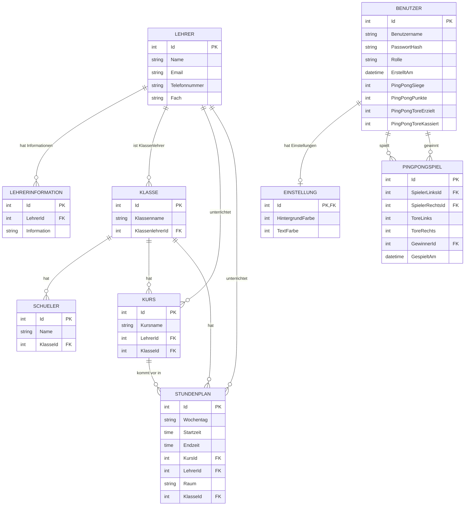

# SchulApp

SchulApp ist eine Schulverwaltungsanwendung mit **C#**, **.NET 10** und **Windows Forms**.

Die Anwendung verwaltet zentrale Schuldaten wie **Schüler, Lehrer, Klassen, Kurse und Stundenpläne**. Die Daten werden in einer lokalen **Microsoft SQL Server 2022** Datenbank gespeichert und über **Entity Framework Core** verarbeitet.

Zusätzlich enthält das Projekt ein eigenes Login- und Registrierungssystem mit Rollen und Berechtigungen, benutzerspezifische Design-Einstellungen, Profilbilder, eine REST API sowie ein integriertes PingPong-Spiel mit Bestenliste.

## Inhaltsverzeichnis

- [Funktionen](#funktionen)
- [Programmstart](#programmstart)
- [Login und Registrierung](#login-und-registrierung)
- [Rollen und Berechtigungen](#rollen-und-berechtigungen)
- [PingPong](#pingpong)
- [Bestenliste](#bestenliste)
- [REST API](#rest-api)
- [Verwaltete Daten](#verwaltete-daten)
- [Datenbank und Entity Framework Core](#datenbank-und-entity-framework-core)
- [Architektur und Service-Schicht](#architektur-und-service-schicht)
- [Theme-Management](#theme-management)
- [Benutzeroberfläche](#benutzeroberfläche)
- [CRUD-Funktionen](#crud-funktionen)
- [Datenvalidierung und Abhängigkeiten](#datenvalidierung-und-abhängigkeiten)
- [Technologien](#technologien)
- [Projektstruktur](#projektstruktur)
- [Setup](#setup)
- [Unit-Tests](#unit-tests)
- [Definition of Done](#definition-of-done)

## Funktionen

Zu den wichtigsten Funktionen der Anwendung gehören:

- Schüler anzeigen, erstellen, bearbeiten und löschen
- Schüler einer Klasse zuweisen
- Schüler in einer `DataGridView` Tabelle anzeigen
- Lehrer anzeigen, erstellen, bearbeiten und löschen
- Informationen, Fach, E-Mail und Telefonnummer zu Lehrern speichern
- Zusätzliche Lehrerinformationen separat speichern und verwalten
- Klassen anzeigen, erstellen, bearbeiten und löschen
- Schüler Klassen zuordnen
- Klassenlehrer einer Klasse zuweisen
- Anzahl der zugeordneten Schüler in der Klassenübersicht anzeigen
- Kurse anzeigen, erstellen, bearbeiten und löschen
- Lehrer einem Kurs zuordnen
- Klassen einem Kurs zuordnen
- Stundenplaneinträge anzeigen, erstellen, bearbeiten und löschen
- Wochentag, Startzeit und Endzeit eines Stundenplaneintrags verwalten
- Kurs, Klasse, Lehrer, Raum und Zeit im Stundenplan darstellen
- Stundenplaneinträge nach Wochentag und Uhrzeit sortieren
- Prüfen, dass die Endzeit nach der Startzeit liegt
- Aktuelles Datum und aktuelle Uhrzeit anzeigen
- Löschen von Datensätzen vor dem Ausführen bestätigen
- Abhängige Datensätze vor ungültigem Löschen schützen
- Benutzer über Login anmelden
- Neue Benutzer über eine Registrierungsseite erstellen
- Rollenabhängige Zugriffsrechte anwenden
- Passwörter mit BCrypt hashen und prüfen
- Profilbilder pro Benutzer anzeigen
- Design-Einstellungen pro Benutzer speichern
- PingPong zwischen zwei vorhandenen Benutzern spielen
- PingPong-Spiele bis 5 Punkte durchführen
- Laufende PingPong-Spiele über `Q` oder beim Minimieren pausieren
- Spielergebnisse über die REST API speichern
- Eine REST-basierte Bestenliste anzeigen

## Programmstart

Für den normalen Start müssen **SQL Server** und die Datenbank `SchulAppDB` verfügbar sein.

Beim ersten Einrichten des Projekts muss nur dieses eine SQL-Skript ausgeführt werden:

```text
SchulApp/SQL/SchulAppDB.sql
```

Das Skript richtet die benötigte Datenbankstruktur inklusive der PingPong- und Bestenlisten-Daten ein.

Danach wird die komplette Anwendung aus dem **Hauptordner `Schulapp`** mit einem einzigen Befehl gestartet:

```powershell
.\start.ps1
```

`start.ps1` startet zuerst die **schulAppREST** API, wartet bis sie erreichbar ist und startet danach die **WinForms-Anwendung**.

Der Startvorgang der WinForms-Anwendung läuft vereinfacht so ab:

1. Die Anwendung wird initialisiert.
2. Eine vorhandene lokale `.env` Datei kann eingelesen werden.
3. Der LoadingScreen wird angezeigt.
4. Die Verbindung zur SQL-Datenbank wird geprüft.
5. Bei erfolgreicher Datenbankverbindung wird das Login geöffnet.
6. Nach erfolgreichem Login wird die eigentliche Anwendung geöffnet.
7. Die zum angemeldeten Benutzer gehörenden Design-Einstellungen werden geladen.
8. Die Berechtigungen werden anhand der Benutzerrolle angewendet.
9. Das App-Icon wird zentral auf die geöffneten Forms angewendet.

Kann keine Verbindung zur Datenbank hergestellt werden, wird eine Fehlermeldung angezeigt und der normale Startvorgang beendet.

Für PingPong und die Bestenliste muss die REST API laufen. Beim Start über `.\start.ps1` wird sie automatisch gestartet.
## Login und Registrierung

Die Anwendung verfügt über ein eigenes Login mit Benutzername und Passwort.

Die Benutzerkonten werden in der SQL-Datenbank gespeichert. Passwörter werden nicht im Klartext abgelegt, sondern mit **BCrypt** gehasht.

Beim Login wird der eingegebene Benutzername in der Datenbank gesucht. Das eingegebene Passwort wird anschliessend gegen den gespeicherten BCrypt-Hash geprüft.

### Registrierung

Neue Benutzer können über eine eigene Registrierungsseite angelegt werden.

Bei der Registrierung wird zusätzlich eine Rolle ausgewählt:

- Admin
- Lehrer
- Schüler

Für die Registrierung gelten unter anderem folgende Validierungen:

- Benutzername muss mindestens 3 Zeichen lang sein
- Passwort muss mindestens 8 Zeichen lang sein
- Benutzername muss eindeutig sein
- Erforderliche Felder dürfen nicht leer sein
- Eine gültige Benutzerrolle muss ausgewählt sein

Der Benutzername, der Passwort-Hash und die Rolle werden anschliessend in der Datenbank gespeichert.

Beim Wechsel zwischen Login und Registrierung wird die Fensterposition beibehalten.

### `.env` Datei

Die Anwendung kann beim Start optional eine lokale `.env` Datei einlesen.

Benutzername und Passwort für das Login werden nicht aus der `.env` Datei geladen. Benutzerkonten werden über die Anwendung registriert und in der Datenbank gespeichert.

Für die REST API kann optional die Umgebungsvariable `SCHULAPP_API_BASE_URL` gesetzt werden. Ohne diese Variable verwendet der PingPong-Service standardmässig:

```text
https://localhost:63635/
```

Die vollständige Einrichtung ist in [SETUP.md](SETUP.md) beschrieben.

## Rollen und Berechtigungen

Die Anwendung unterscheidet zwischen den drei Benutzerrollen **Admin**, **Lehrer** und **Schüler**.

### Admin

Ein Admin besitzt vollständige Verwaltungsrechte und kann unter anderem:

- Schüler verwalten
- Lehrer verwalten
- Klassen verwalten
- Kurse verwalten
- Stundenplaneinträge verwalten
- Einstellungen verwenden und ändern
- Profil verwenden
- PingPong und Bestenliste öffnen

### Lehrer

Ein Lehrer kann:

- Schüler verwalten
- Stundenplaneinträge verwalten
- Einstellungen verwenden und ändern
- Profil verwenden
- PingPong und Bestenliste öffnen

Ein Lehrer kann keine Lehrer, Klassen oder Kurse verwalten.

### Schüler

Ein Schüler besitzt für die Schuldaten hauptsächlich Leserechte.

Ein Schüler kann:

- den Stundenplan anzeigen
- eigene Design-Einstellungen verwenden und ändern
- das eigene Profil verwenden
- PingPong und Bestenliste öffnen

### Abmelden

Über den **Abmelden**-Button im Hauptmenü kann die aktuelle Sitzung beendet werden. Anschliessend wird wieder das Login angezeigt.

## PingPong

Die Anwendung enthält ein einfaches Zwei-Spieler-PingPong-Spiel als zusätzliche Funktion.

### Spieler

Der linke Spieler ist immer der aktuell eingeloggte Benutzer.

Der rechte Spieler wird vor dem Spiel aus den vorhandenen Benutzern ausgewählt. Die Benutzer werden über die REST API geladen. Der aktuell angemeldete Benutzer wird nicht als eigener Gegner angeboten.

Für ein Spiel müssen deshalb mindestens zwei Benutzerkonten existieren.

### Steuerung

Linker Spieler:

```text
W = hoch
S = runter
```

Rechter Spieler:

```text
Pfeiltaste hoch = hoch
Pfeiltaste runter = runter
```

Pausenmenü:

```text
Q = Spiel pausieren
```

Im Pausenmenü kann das Spiel mit **Fortsetzen** weitergespielt oder über **Zurück zum Hauptmenü** verlassen werden.

Wird das Fenster während eines laufenden Spiels minimiert, wird das Spiel ebenfalls automatisch pausiert. Nach dem Wiederherstellen kann es über **Fortsetzen** weitergespielt werden.

### Spielfeld

Die obere Spielfeldgrenze wird durch `panelTop` definiert. Ball und Schläger können nicht oberhalb dieses Bereichs spielen.

Der Ball prallt an:

- `panelTop`
- der unteren Fenstergrenze
- `panelLinks`
- `panelRechts`

ab.

### Punktesystem im Spiel

Ein Spieler erhält einen Spielpunkt, wenn der Ball auf der Seite des Gegners das Spielfeld verlässt.

Ein Spiel endet, sobald ein Spieler **5 Punkte** erreicht.

Nach jedem normalen Punkt werden Ball und Schläger wieder auf ihre Startposition gesetzt und das Spiel wird fortgesetzt.

Der aktuelle Punktestand wird über `punkteZahlLabel` angezeigt.

### Spielende

Sobald ein Spieler 5 Punkte erreicht:

1. Der Timer wird gestoppt.
2. Der Gewinner wird angezeigt.
3. Das Endergebnis wird angezeigt.
4. Das Ergebnis wird über die REST API gespeichert.
5. Die Bestenlistenwerte werden aktualisiert.
6. Danach kann erneut gespielt oder zum Hauptmenü zurückgekehrt werden.

Bei **Erneut spielen** wird der Punktestand auf `0 : 0` zurückgesetzt und ein neues Spiel mit denselben ausgewählten Benutzern gestartet.

## Bestenliste

Die Anwendung enthält eine eigene `Bestenliste` Form.

Die Bestenliste lädt ihre Daten beim Öffnen automatisch über die REST API und zeigt pro Benutzer:

- Benutzername
- Siege
- Punkte
- erzielte Tore
- kassierte Tore
- Torverhältnis

Für jeden PingPong-Sieg erhält der Gewinner:

```text
1 Sieg
3 Punkte
```

Zusätzlich werden für beide Spieler die erzielten und kassierten Tore aktualisiert.

Das Torverhältnis wird berechnet als:

```text
erzielte Tore - kassierte Tore
```

Die Sortierung erfolgt in dieser Reihenfolge:

1. Punkte absteigend
2. Torverhältnis absteigend
3. erzielte Tore absteigend
4. Benutzername

Die Bestenliste wird nicht lokal in der WinForms-Anwendung gespeichert.

## REST API

Zum Projekt gehört die bestehende **schulAppREST** ASP.NET Core REST API.

Die PingPong-Funktionen verwenden `PingPongApiService` in der WinForms-Anwendung, um mit dieser API zu kommunizieren.

### PingPong-Endpunkte

#### Bestenliste laden

```http
GET /api/PingPong/bestenliste
```

Der Endpoint liefert die aktuellen PingPong-Werte aller Benutzer.

#### Spiel speichern

```http
POST /api/PingPong/spiel
```

Ein Beispiel für den Request-Body:

```json
{
  "spielerLinksId": 1,
  "spielerRechtsId": 2,
  "toreLinks": 5,
  "toreRechts": 3
}
```

Die API prüft unter anderem:

- beide Benutzer müssen unterschiedlich sein
- beide Benutzer müssen existieren
- Tore müssen zwischen 0 und 5 liegen
- das Ergebnis darf nicht unentschieden sein
- genau ein Spieler muss 5 Punkte erreicht haben

Beim Speichern werden:

- das konkrete Spiel in `PingPongSpiel` gespeichert
- Siege aktualisiert
- Bestenlistenpunkte aktualisiert
- erzielte Tore aktualisiert
- kassierte Tore aktualisiert

## Verwaltete Daten

### Schüler

Für Schüler werden unter anderem folgende Daten verwaltet:

- ID
- Name
- Klasse

### Lehrer

Für Lehrer können unter anderem folgende Daten gespeichert werden:

- ID
- Name
- E-Mail
- Telefonnummer
- Fach
- zusätzliche Informationen

### Klassen

Für Klassen werden unter anderem folgende Daten verwaltet:

- ID
- Klassenname
- Klassenlehrer
- zugeordnete Schüler
- Anzahl zugeordneter Schüler

### Kurse

Für Kurse werden unter anderem folgende Daten verwaltet:

- ID
- Kursname
- Lehrer
- Klasse

### Stundenplan

Ein Stundenplaneintrag kann unter anderem folgende Daten enthalten:

- ID
- Wochentag
- Startzeit
- Endzeit
- Kurs
- Lehrer
- Raum
- Klasse

### Benutzer

Für Benutzerkonten werden unter anderem folgende Daten verwaltet:

- ID
- Benutzername
- Passwort-Hash
- Rolle
- Erstellungszeitpunkt
- Profilbild
- PingPong-Siege
- PingPong-Punkte
- PingPong-Tore erzielt
- PingPong-Tore kassiert

### PingPong-Spiel

Abgeschlossene PingPong-Spiele werden zusätzlich gespeichert mit:

- ID
- linker Spieler
- rechter Spieler
- Tore links
- Tore rechts
- Gewinner
- Spielzeitpunkt

### Einstellungen

Für jeden Benutzer können eigene Design-Einstellungen gespeichert werden:

- Benutzer-ID
- Hintergrundfarbe
- Textfarbe

## Entity-Relationship-Diagramm

Das folgende vereinfachte ERD zeigt die wichtigsten Tabellen und Beziehungen.



## Datenbank und Entity Framework Core

Die Daten der Anwendung werden in einer lokalen **Microsoft SQL Server 2022** Datenbank gespeichert.

Für den Datenbankzugriff wird **Entity Framework Core** verwendet. Dadurch können Daten über C# Models und LINQ verarbeitet werden.

Der zentrale Datenbankkontext ist `SchulAppContext`.

Zu den verwendeten Daten gehören unter anderem:

- Einstellungen
- Klassen
- Lehrer
- Schüler
- Lehrerinformationen
- Kurse
- Stundenplaneinträge
- Benutzer
- PingPong-Spiele

Beispiel zum Laden von Daten:

```csharp
using SchulAppContext context = new SchulAppContext();

var klassen = context.Klassen
    .AsNoTracking()
    .ToList();
```

Beispiel zum Speichern:

```csharp
context.Klassen.Add(neueKlasse);
context.SaveChanges();
```

Die Datenbankverbindung wird beim Start der WinForms-Anwendung geprüft:

```csharp
bool verbunden = await context.Database.CanConnectAsync();
```

## Architektur und Service-Schicht

Die Anwendung verwendet mehrere klar getrennte Bereiche.

### Models

Models bilden die Datenstrukturen der Anwendung und der Datenbank ab.

### Data

`SchulAppContext` übernimmt den Entity-Framework-Zugriff auf SQL Server.

### Repository und Service

Für die Schülerverwaltung ist der Datenzugriff zusätzlich über Repository und Service getrennt.

Die Service-Schicht enthält unter anderem Geschäftslogik und Validierungen.

### PingPongApiService

`PingPongApiService` übernimmt die Kommunikation der WinForms-Anwendung mit der REST API.

Der Service:

- lädt die Bestenliste
- lädt damit die verfügbaren Benutzer für PingPong
- sendet abgeschlossene Spielergebnisse an die REST API

Die WinForms-Anwendung speichert die PingPong-Bestenlistenwerte dadurch nicht selbst direkt in SQL.

## Theme-Management

Das Projekt enthält einen zentralen `ThemeManager`.

Dieser verwaltet:

- Hintergrundfarbe
- Textfarbe
- Laden der gespeicherten Farben des angemeldeten Benutzers
- Speichern geänderter Farben
- Anwenden des Designs auf Forms
- Aktualisieren bereits geöffneter Forms
- Zurücksetzen auf Standardfarben

Die Theme-Einstellungen werden pro Benutzer in der SQL-Datenbank gespeichert.

Hintergrundfarbe und Textfarbe dürfen nicht identisch sein.

Neue Forms wie `PingPong` und `Bestenliste` verwenden ebenfalls den vorhandenen `ThemeManager`.

## Benutzeroberfläche

Die grafische Benutzeroberfläche wird mit Windows Forms umgesetzt.

Verwendete Controls sind unter anderem:

- `Label`
- `TextBox`
- `ComboBox`
- `Button`
- `DataGridView`
- `PictureBox`
- `Panel`
- `ProgressBar`
- `ColorDialog`
- `DateTimePicker`
- `Timer`

Die Anwendung ist in mehrere eigene Forms aufgeteilt:

- LoadingScreen
- Login
- Register
- Hauptmenü
- Schüler
- Lehrer
- Klassen
- Kurse
- Stundenplan
- Einstellungen
- Profil
- PingPong
- Bestenliste

Das Hauptmenü steuert die rollenabhängige Navigation. PingPong und Bestenliste werden über die vorhandene Fensterlogik geöffnet.

## CRUD-Funktionen

Die Anwendung verwendet CRUD-Operationen zur Verwaltung der Schuldaten.

| Operation | Bedeutung |
|---|---|
| Create | Neue Daten erstellen |
| Read | Gespeicherte Daten anzeigen |
| Update | Bestehende Daten bearbeiten |
| Delete | Daten löschen |

Mit Entity Framework Core werden dafür unter anderem verwendet:

- `Add()`
- LINQ
- Model-Eigenschaften
- `Remove()`
- `SaveChanges()`
- `SaveChangesAsync()`
- `AsNoTracking()`

## Datenvalidierung und Abhängigkeiten

Die Anwendung enthält Prüfungen, damit keine ungültigen oder inkonsistenten Daten gespeichert werden.

Unter anderem gelten folgende Regeln:

- Die Endzeit eines Stundenplaneintrags muss nach der Startzeit liegen.
- Ein Kurs kann nicht gelöscht werden, wenn er noch verwendet wird.
- Eine Klasse kann nicht gelöscht werden, solange ihr noch Schüler zugeordnet sind.
- Eine Klasse kann nicht gelöscht werden, solange ihr noch Kurse zugeordnet sind.
- Benötigte Referenzdaten werden vor abhängigen Datensätzen geladen.
- Die Registrierung validiert Benutzername, Passwort und Rolle.
- Rollenabhängige Berechtigungen verhindern nicht erlaubte Aktionen.
- Ein PingPong-Spiel benötigt zwei unterschiedliche Benutzer.
- Ein gültiges PingPong-Ergebnis endet mit genau einem Spieler bei 5 Punkten.

## Technologien

Für die Entwicklung werden unter anderem folgende Technologien verwendet:

- C#
- .NET 10
- Windows Forms
- ASP.NET Core Web API
- Visual Studio 2026
- Microsoft SQL Server 2022
- Entity Framework Core
- Microsoft.Data.SqlClient
- BCrypt
- DotNetEnv
- HttpClient
- xUnit
- Git
- GitHub

### NuGet-Pakete

Unter anderem werden folgende Pakete beziehungsweise Bibliotheken verwendet:

```text
Microsoft.EntityFrameworkCore
Microsoft.EntityFrameworkCore.SqlServer
Microsoft.Data.SqlClient
DotNetEnv
BCrypt.Net-Next
xunit
```

## Projektstruktur

Eine vereinfachte Struktur sieht folgendermassen aus:

```text
Schulapp
│
├── start.ps1
│
├── SchulApp
│   ├── Data
│   ├── Models
│   │   └── BestenlisteEintragModel.cs
│   ├── Repositories
│   ├── Services
│   │   └── PingPongApiService.cs
│   ├── images
│   ├── Screenshots
│   ├── SQL
│   │   ├── SchulAppDB.sql
│   ├── Login.cs
│   ├── Register.cs
│   ├── LoadingScreen.cs
│   ├── Hauptmenue.cs
│   ├── Schueler.cs
│   ├── Lehrer.cs
│   ├── Klassen.cs
│   ├── Kurse.cs
│   ├── Stundenplan.cs
│   ├── Einstellungen.cs
│   ├── Profil.cs
│   ├── PingPong.cs
│   ├── Bestenliste.cs
│   ├── ThemeManager.cs
│   └── Program.cs
│
└── schulAppREST
    ├── Controllers
    │   └── PingPongController.cs
    ├── Data
    │   └── SchulAppContext.cs
    ├── Models
    │   └── PingPongSpiel.cs
    └── Program.cs
```

## Setup

Für den normalen lokalen Start sind nur wenige Schritte nötig:

1. Microsoft SQL Server starten.
2. Beim ersten Einrichten einmal `SchulApp/SQL/SchulAppDB.sql` ausführen.
3. Im Hauptordner `Schulapp` PowerShell öffnen.
4. Die Anwendung starten:

```powershell
.\start.ps1
```

Das Startskript startet die REST API und danach automatisch die WinForms-Anwendung. Ein separates `dotnet run` für `schulAppREST` oder `SchulApp` ist im normalen Ablauf nicht nötig.

Für PingPong müssen mindestens zwei Benutzerkonten vorhanden sein.

Die vollständige Anleitung befindet sich in [SETUP.md](SETUP.md).
## Unit-Tests

Für Teile der Service-Schicht werden Unit-Tests mit **xUnit** verwendet.

Für die Schüler-Service-Schicht kann eine Fake-Repository-Implementierung verwendet werden, damit die Geschäftslogik unabhängig von einer echten Datenbank getestet werden kann.

Die Tests prüfen unter anderem:

- Erstellen von Daten
- Bearbeiten von Daten
- Löschen von Daten
- Validierungen der Service-Schicht

## Definition of Done

Das Projekt gilt als funktionsfähig, wenn unter anderem:

- die Windows-Forms-Anwendung startet
- der LoadingScreen angezeigt wird
- die Datenbankverbindung geprüft wird
- Login und Registrierung funktionieren
- Passwörter gehasht gespeichert werden
- Rollen und Berechtigungen funktionieren
- Schuldaten verwaltet werden können
- Stundenplanzeiten validiert werden
- Theme-Einstellungen pro Benutzer gespeichert und geladen werden
- Profilbilder verwendet werden können
- die REST API gestartet werden kann
- die Bestenliste über die REST API geladen werden kann
- mindestens zwei Benutzer für PingPong ausgewählt werden können
- PingPong bis 5 Punkte gespielt werden kann
- abgeschlossene Spiele über die REST API gespeichert werden
- der Gewinner 1 Sieg und 3 Bestenlistenpunkte erhält
- erzielte und kassierte Tore aktualisiert werden
- die Bestenliste korrekt sortiert wird
- Unit-Tests erfolgreich durchlaufen
