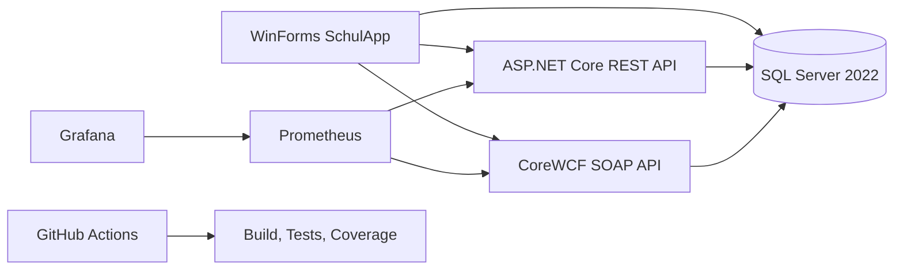
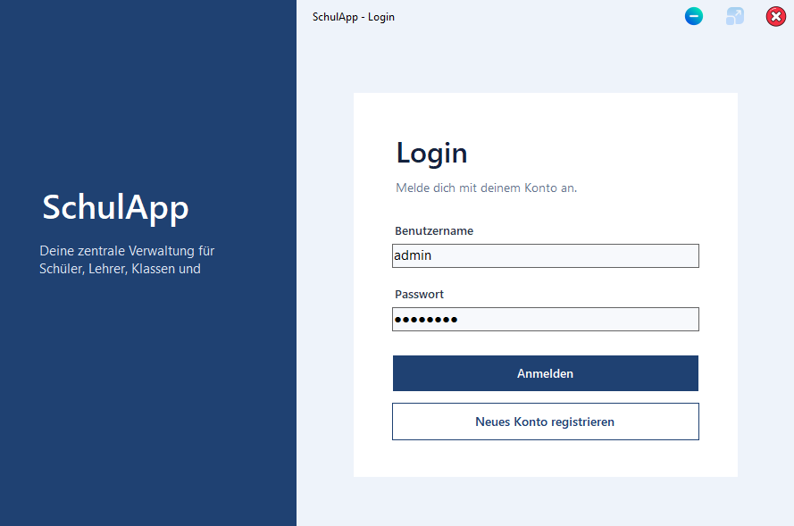

# SchulApp

Eine Windows-Desktopanwendung zur Verwaltung von Schülern, Lehrern, Klassen, Kursen und Stundenplänen. Das Projekt kombiniert eine **C# WinForms-Anwendung**, eine **ASP.NET Core REST API**, eine **CoreWCF SOAP API**, **SQL Server**, automatisierte Tests sowie **Prometheus- und Grafana-Monitoring**.

[](https://github.com/FionnLaesser/SchulApp/actions/workflows/build-and-test.yml)


<p align="center">
  
</p>

## Überblick

SchulApp ist ein Lern- und Praxisprojekt für eine kleine Schulverwaltung. Die Anwendung deckt klassische CRUD-Funktionen, Rollen und Berechtigungen, mehrere API-Stile, Monitoring, Tests und CI/CD in einem gemeinsamen Repository ab.

Die wichtigsten Bestandteile sind:

- **Desktop-App:** C# mit .NET 10 und Windows Forms
- **Datenzugriff:** Entity Framework Core mit Microsoft SQL Server 2022
- **REST API:** ASP.NET Core mit Swagger/OpenAPI, Health Check und zentralem Exception Handling
- **SOAP API:** CoreWCF mit WSDL und Schüler-CRUD
- **Monitoring:** Prometheus und Grafana über Docker Compose
- **Tests:** xUnit, EF Core InMemory und Coverlet
- **CI/CD:** GitHub Actions für Restore, Release-Build, Tests und Code Coverage

## Hauptfunktionen

| Bereich | Aktueller Funktionsumfang |
|---|---|
| Schüler | Anzeigen, erstellen, bearbeiten, löschen und Klassen zuweisen |
| Lehrer | Anzeigen, erstellen, bearbeiten, löschen und Zusatzinformationen verwalten |
| Klassen | Klassen verwalten, Klassenlehrer zuweisen und Schülerzuordnungen anzeigen |
| Kurse | Kurse verwalten und Lehrer sowie Klassen zuordnen |
| Stundenplan | Einträge mit Wochentag, Zeit, Kurs, Klasse, Lehrer und Raum verwalten |
| Benutzer | Registrierung, Login, BCrypt-Passwort-Hashes und Rollen |
| Profil | Profilinformationen und Profilbild pro Benutzer |
| Einstellungen | Benutzerabhängige Farben und PingPong-Ballgeschwindigkeit |
| Audit Log | Administrative Änderungen mit Aktion, Entität, Benutzer, Quelle und Zeit erfassen |
| Import | Mehrere Schüler aus CSV importieren und Eingaben vor dem Speichern validieren |
| Importvorlage | Passende CSV-Vorlage mit `Name;KlasseId` direkt aus der Anwendung herunterladen |
| Export | Schüler, Klassen, Stundenplan und Audit Log als CSV oder PDF exportieren |
| PingPong | Zwei-Spieler-Minispiel mit REST-basierter Ergebnisablage und Bestenliste |

## Architektur



Die WinForms-Anwendung verwendet je nach Funktion direkten EF-Core-Datenzugriff, REST-Aufrufe oder SOAP-Aufrufe. REST und SOAP greifen ebenfalls auf dieselbe lokale `SchulAppDB` zu.

## Rollen und Berechtigungen

Die Anwendung unterscheidet aktuell drei Rollen:

| Rolle | Rechte |
|---|---|
| **Admin** | Vollzugriff auf Schulverwaltung, Audit Log und Datenimport/-export |
| **Lehrer** | Schüler verwalten und Stundenpläne bearbeiten |
| **Schüler** | Stundenplan ansehen |

Profil, Einstellungen, PingPong und Bestenliste stehen zusätzlich im normalen Benutzerbereich zur Verfügung.

Die Berechtigungen werden im Hauptmenü angewendet. Weitere rollenbasierte Einschränkungen für Import und Export werden separat weiterentwickelt.

## Datenimport und Export

Der Bereich für Datenübertragung ist aktuell für Administratoren verfügbar.

### Export

Folgende Datensätze können als **CSV** oder **PDF** exportiert werden:

- Schülerliste
- Klassenliste
- Stundenplan
- Audit Log

CSV-Dateien werden UTF-8-kompatibel erzeugt, damit Sonderzeichen wie `ä`, `ö` und `ü` korrekt erhalten bleiben.

### Schüler-Import

Schüler können gesammelt aus einer CSV-Datei importiert werden. Die Datei benötigt mindestens diese Spalten:

```csv
Name;KlasseId
Müller Anna;1
```

Vor dem Speichern werden unter anderem Pflichtfelder, Klassen-IDs, Datentypen und Duplikate geprüft. Bei Validierungsfehlern wird der Import abgebrochen, damit keine teilweise ungültige Datenmenge gespeichert wird.

Über **CSV-Importvorlage herunterladen** kann direkt aus der Anwendung eine passende Beispieldatei gespeichert werden.

## REST API

Das Projekt `schulAppREST` stellt die REST-Schnittstelle bereit.

Aktuelle Controller-Bereiche:

- Schüler
- Lehrer
- Klassen
- Kurse
- Stundenplan
- Einstellungen
- PingPong und Bestenliste
- Health Check

Wichtige lokale Adressen:

| Dienst | URL |
|---|---|
| Swagger UI | `https://localhost:63635/swagger` |
| REST API HTTPS | `https://localhost:63635` |
| REST API HTTP | `http://localhost:63636` |
| Health Check | `https://localhost:63635/health` |
| Prometheus Metrics | `http://localhost:63636/metrics` |

Im Development-Modus dokumentiert Swagger die verfügbaren Endpunkte. Unerwartete API-Fehler werden über eine zentrale Middleware in ein einheitliches JSON-Fehlerformat umgewandelt.

Eine vorhandene Postman-Collection liegt unter [`Postman/SchulAppRESTAPI.postman_collection`](Postman/SchulAppRESTAPI.postman_collection).

## SOAP API

Das Projekt `SchulappSOAP` verwendet **CoreWCF** und stellt einen Schüler-Service über `BasicHttpBinding` bereit.

Aktuelle Operationen:

```text
GetSchueler
GetSchuelerById
AddSchueler
UpdateSchueler
DeleteSchueler
```

Lokale Adressen:

| Dienst | URL |
|---|---|
| SOAP Service | `http://localhost:5210/SchuelerService.svc` |
| WSDL | `http://localhost:5210/SchuelerService.svc?wsdl` |
| Prometheus Metrics | `http://localhost:5210/metrics` |

Die WinForms-Anwendung bindet den Service über eine generierte WCF Web Service Reference ein.

## Monitoring und Health Check

Prometheus und Grafana werden über [`Monitoring/docker-compose.yml`](Monitoring/docker-compose.yml) gestartet.

Aktuell verwendet das Repository:

- Prometheus `v3.13.1`
- Grafana `13.1.0`
- Scrape-Intervall von 5 Sekunden
- Prometheus-Retention von 30 Tagen

Überwacht werden unter anderem:

- Erreichbarkeit der REST API
- Erreichbarkeit der SOAP API
- Datenbankstatus
- Request-Anzahlen
- HTTP-Statuscodes und Fehler
- Antwortzeiten

Lokale Oberflächen:

```text
Prometheus: http://localhost:9090
Grafana:    http://localhost:3000
```

Standardmässiger lokaler Grafana-Login:

```text
Benutzer: admin
Passwort: schulapp
```

Der REST Health Check unter `https://localhost:63635/health` prüft zusätzlich den aktuellen Zustand der REST API, der SQL-Datenbank und der SOAP API.

Mehr Details: [`Monitoring/README.md`](Monitoring/README.md)

## Tests und Code Coverage

Auf dem aktuellen `master` enthält `SchulApp.Tests` **32 automatisierte xUnit-Tests**.

Getestet werden unter anderem:

- lokale Schüler-Service-Logik
- REST-Schüler-CRUD
- SOAP-Schüler-CRUD und Audit-Logging
- Global Exception Middleware
- CSV-Parsing und Validierung
- CSV/PDF-Datentransfer
- herunterladbare Schüler-Importvorlage

Die API-Tests verwenden EF Core InMemory, damit die produktive lokale `SchulAppDB` nicht verändert wird.

Tests lokal ausführen:

```powershell
dotnet test .\SchulApp.Tests\SchulApp.Tests.csproj
```

GitHub Actions führt bei Pushes und Pull Requests automatisch aus:

1. Restore
2. Release-Build
3. xUnit-Tests
4. XPlat Code Coverage über Coverlet
5. HTML-Coverage-Report über ReportGenerator
6. Upload des Reports als `code-coverage-report` Artifact

Der konkrete Coverage-Wert wird bei jedem CI-Lauf neu berechnet und im GitHub Actions Summary angezeigt. Dadurch muss kein schnell veraltender statischer Prozentwert in dieser README gepflegt werden.

Mehr Details: [`SchulApp.Tests/README.md`](SchulApp.Tests/README.md)

## Schnellstart

### Voraussetzungen

- Windows
- .NET 10 SDK
- Microsoft SQL Server 2022
- Docker Desktop mit Docker Compose
- PowerShell
- optional Visual Studio mit .NET-10-Unterstützung

### 1. Repository klonen

```powershell
git clone https://github.com/FionnLaesser/SchulApp.git
cd SchulApp
```

### 2. Datenbank einrichten

Das zentrale SQL-Skript ausführen:

```text
SchulApp/SQL/SchulAppDB.sql
```

Es erstellt beziehungsweise aktualisiert die benötigte Struktur für `SchulAppDB`.

### 3. Abhängigkeiten wiederherstellen

```powershell
dotnet restore .\SchulApp.slnx
```

### 4. Anwendung starten

```powershell
.\start.ps1
```

Das Startskript prüft Docker, startet Prometheus und Grafana, startet REST und SOAP, wartet auf die benötigten Endpunkte und öffnet danach die WinForms-Anwendung.

Eine ausführliche Installations- und Fehlerbehebungsanleitung steht in [`SETUP.md`](SETUP.md).

## Projektstruktur

```text
SchulApp/
├── .github/workflows/        GitHub Actions CI und Coverage
├── Monitoring/               Docker Compose, Prometheus und Grafana
├── Postman/                  REST API Postman-Collection
├── Screenshots/              Screenshots und UI-Galerie
├── SchulApp/                 WinForms-Hauptanwendung
│   ├── Data/                 EF-Core-Kontext und Repositories
│   ├── Models/               Domänenmodelle
│   ├── Services/             Anwendungs- und API-Services
│   ├── SQL/                  Datenbankskripte
│   └── images/               UI-Ressourcen
├── schulAppREST/             ASP.NET Core REST API
├── SchulappSOAP/             CoreWCF SOAP API
├── SchulApp.Tests/           xUnit-Testprojekt
├── README.md                 Projektübersicht
├── SETUP.md                  Einrichtung und Troubleshooting
├── SchulApp.slnx             Gemeinsame Solution
└── start.ps1                 Gemeinsamer lokaler Start
```

## Screenshots

Weitere Ansichten der Anwendung sind in der [`Screenshots/README.md`](Screenshots/README.md) zusammengefasst.

Beispiele:

| Login | Schülerverwaltung |
|---|---|
|  |  |

| Stundenplan | Monitoring-relevante Hauptanwendung |
|---|---|
|  |  |

## Dokumentation

| Dokument | Inhalt |
|---|---|
| [`README.md`](README.md) | Projektüberblick, Architektur und wichtigste Funktionen |
| [`SETUP.md`](SETUP.md) | Installation, Start, lokale Endpunkte und Troubleshooting |
| [`Monitoring/README.md`](Monitoring/README.md) | Prometheus, Grafana, Metriken und Docker Compose |
| [`SchulApp.Tests/README.md`](SchulApp.Tests/README.md) | Testaufbau, Testbereiche und Coverage |
| [`Screenshots/README.md`](Screenshots/README.md) | UI-Screenshot-Galerie |
| [`Postman/SchulAppRESTAPI.postman_collection`](Postman/SchulAppRESTAPI.postman_collection) | REST API Requests für Postman |

## Entwicklungsstand

SchulApp wird aktiv weiterentwickelt. Offene Features und Bugs werden über die [GitHub Issues](https://github.com/FionnLaesser/SchulApp/issues) verwaltet. Die README beschreibt den Stand des `master`-Branches und enthält bewusst keine geplanten Features als bereits vorhandene Funktionalität.
