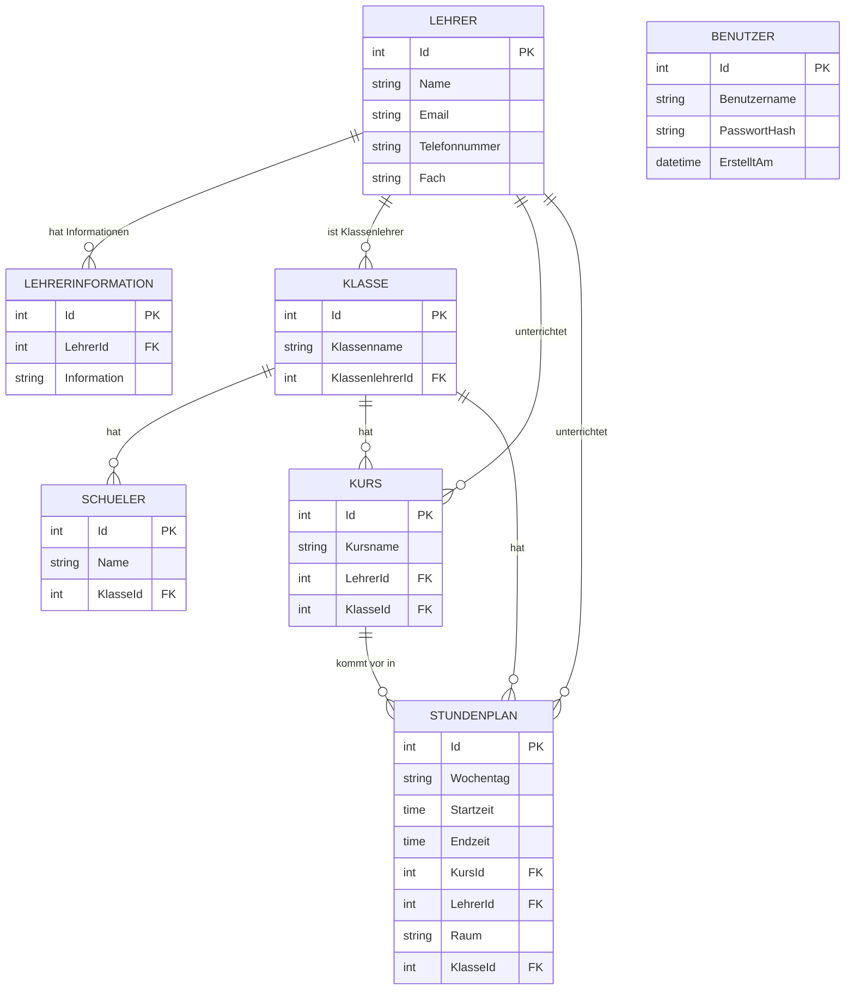

# SchulApp

SchulApp ist eine vollständige Schulverwaltungsanwendung, die mit **C#**, **.NET** und **Windows Forms** entwickelt wurde.

Die Anwendung dient dazu, wichtige Schuldaten wie **Schüler, Lehrer, Klassen, Kurse und Stundenpläne** zentral und übersichtlich zu verwalten. Die Daten werden in einer lokalen **Microsoft SQL Server 2022** Datenbank gespeichert. Für den Datenbankzugriff wird **Entity Framework Core** verwendet.

Zusätzlich enthält die Anwendung unter anderem ein eigenes Login- und Registrierungssystem, einen LoadingScreen mit automatischer Datenbankprüfung, persistente Design-Einstellungen sowie eine Service- und Repository-Struktur für Schülerdaten.

## Inhaltsverzeichnis

- [Funktionen](#funktionen)
- [Programmstart](#programmstart)
- [Login und Registrierung](#login-und-registrierung)
- [Zusätzliche Erweiterungen](#zusätzliche-erweiterungen)
- [Verwaltete Daten](#verwaltete-daten)
- [Datenbank und Entity Framework Core](#datenbank-und-entity-framework-core)
- [Architektur und Service-Schicht](#architektur-und-service-schicht)
- [Theme-Management](#theme-management)
- [Benutzeroberfläche](#benutzeroberfläche)
- [CRUD-Funktionen](#crud-funktionen)
- [Datenvalidierung und Abhängigkeiten](#datenvalidierung-und-abhängigkeiten)
- [Technologien](#technologien)
- [Projektstruktur](#projektstruktur)
- [Setup](#setup)
- [App-Demo](#app-demo)
- [Unit-Tests](#unit-tests)
- [Definition of Done](#definition-of-done)

## Funktionen

Zu den wichtigsten Funktionen der Anwendung gehören:

- Schüler anzeigen, erstellen, bearbeiten und löschen
- Schüler einer Klasse zuweisen
- Schüler übersichtlich in einer `DataGridView` Tabelle anzeigen
- Lehrer anzeigen, erstellen, bearbeiten und löschen
- Informationen, Fach, E-Mail und Telefonnummer zu Lehrern speichern
- Zusätzliche Lehrerinformationen separat speichern und verwalten
- Klassen anzeigen, erstellen, bearbeiten und löschen
- Schüler Klassen zuordnen
- Klassenlehrer einer Klasse zuweisen
- Anzahl der zugeordneten Schüler in der Klassenübersicht anzeigen
- Kurse anzeigen, erstellen, bearbeiten und löschen
- Lehrer einem Kurs zuordnen
- Klassen einem Kurs zuordnen
- Zugehörige Klasse und Lehrer in der Kursübersicht anzeigen
- Stundenplaneinträge anzeigen, erstellen, bearbeiten und löschen
- Wochentag, Startzeit und Endzeit eines Stundenplaneintrags verwalten
- Kurs, Klasse, Lehrer und Raum eines Stundenplaneintrags anzeigen
- Stundenplaneinträge nach Wochentag und Uhrzeit sortiert darstellen
- Prüfen, dass die Endzeit eines Stundenplaneintrags nach der Startzeit liegt
- Aktuelles Datum und aktuelle Uhrzeit anzeigen
- Löschen von Datensätzen vor dem Ausführen bestätigen
- Verknüpfte Daten wie Lehrer, Klassen, Schüler und Kurse gemeinsam darstellen
- Abhängige Datensätze vor ungültigem Löschen schützen
- Einstellungen für Hintergrund- und Textfarbe speichern
- Eigenes App-Icon für die Windows-Forms-Fenster verwenden
- Benutzer über Login anmelden
- Neue Benutzer über eine Registrierungsseite erstellen
- Passwörter mit BCrypt hashen und sicher prüfen

## Programmstart

Beim Start der Anwendung wird zuerst ein eigener **LoadingScreen** angezeigt.

Der Startvorgang läuft vereinfacht folgendermassen ab:

1. Die Anwendung wird initialisiert.
2. Der LoadingScreen wird angezeigt.
3. Die Verbindung zur SQL-Datenbank wird über Entity Framework Core geprüft.
4. Bei erfolgreicher Datenbankverbindung wird der Startvorgang fortgesetzt.
5. Anschliessend wird das Login angezeigt.
6. Erst nach erfolgreichem Login wird die eigentliche Anwendung geöffnet.
7. Die gespeicherten Design-Einstellungen werden geladen und auf die Anwendung angewendet.
8. Das App-Icon wird zentral für geöffnete Windows-Forms-Fenster gesetzt.

Kann keine Verbindung zur Datenbank hergestellt werden, wird eine Fehlermeldung angezeigt und der Startvorgang beendet.

Für das App-Icon wird zentral ein `Application.Idle` Handler verwendet, der das Icon auf die geöffneten Forms anwendet.

## Login und Registrierung

Die Anwendung verfügt über ein eigenes **Login mit Benutzername und Passwort**.

Die Benutzerkonten werden in der SQL-Datenbank gespeichert. Passwörter werden nicht im Klartext abgelegt, sondern vor dem Speichern mit **BCrypt** gehasht.

Beim Login wird der eingegebene Benutzername in der Datenbank gesucht. Das eingegebene Passwort wird anschliessend mit BCrypt gegen den gespeicherten Passwort-Hash geprüft.

Vor beziehungsweise während der Anmeldung wird ausserdem sichergestellt, dass die benötigte Datenbankverbindung verfügbar ist.

### Registrierung

Neue Benutzer können über eine eigene Registrierungsseite angelegt werden.

Für die Registrierung gelten unter anderem folgende Validierungen:

- Benutzername muss mindestens 3 Zeichen lang sein
- Passwort muss mindestens 8 Zeichen lang sein
- Benutzername muss eindeutig sein
- Erforderliche Felder dürfen nicht leer sein

Der Benutzername und der BCrypt-Passwort-Hash werden anschliessend in der Datenbank gespeichert.

Beim Wechsel zwischen Login und Registrierung wird die Formularposition beibehalten, damit sich die Fenster für den Benutzer nicht unnötig verschieben.

### `.env` Datei

Die Anwendung kann beim Start optional eine lokale `.env` Datei einlesen. Sie kann für lokale Umgebungswerte oder Konfigurationen verwendet werden.

Benutzerkonten und Passwort-Hashes werden jedoch in der Datenbank verwaltet und nicht als Admin-Zugangsdaten aus der `.env` Datei gelesen.

Im Repository kann die `.env.example` Datei als Vorlage verwendet werden.

Die vollständige Einrichtung ist in [SETUP.md](SETUP.md) beschrieben.

## Zusätzliche Erweiterungen

Die ursprünglich geplanten Anforderungen des Projekts konnten frühzeitig fertiggestellt werden. Deshalb wurde die Anwendung anschliessend freiwillig um zusätzliche Funktionen erweitert, die über den ursprünglich geplanten Umfang hinausgehen.

Zu diesen Erweiterungen gehören:

- Eigenes Login-System
- Eigene Registrierungsseite
- Speicherung von Benutzerkonten in der SQL-Datenbank
- Sichere Passwort-Hashes mit BCrypt
- Validierung von Benutzername und Passwort bei der Registrierung
- Optionales Laden lokaler Konfiguration aus einer `.env` Datei
- Eigener Loading- beziehungsweise Splashscreen beim Programmstart
- Automatische Prüfung der SQL-Datenbankverbindung beim Start
- Datenbankprüfung über `Database.CanConnectAsync()` von Entity Framework Core
- Zentrales Setzen des App-Icons für geöffnete Forms
- Eigene Einstellungsseite für die Darstellung der Anwendung
- Frei wählbare Hintergrundfarbe über einen `ColorDialog`
- Frei wählbare Textfarbe über einen `ColorDialog`
- Prüfung, dass Hintergrundfarbe und Textfarbe nicht identisch sein können
- Zentraler `ThemeManager` für die Darstellung der Anwendung
- Speicherung der gewählten Hintergrund- und Textfarbe in der SQL-Datenbank
- Automatisches Laden des zuletzt verwendeten Designs
- Sofortige Aktualisierung des Designs bei bereits geöffneten Fenstern
- Möglichkeit, das Design auf die Standardfarben zurückzusetzen
- Anzeige von aktuellem Datum und aktueller Uhrzeit im Stundenplan
- Validierung der Start- und Endzeit im Stundenplan
- Schutz vor dem Löschen noch verwendeter Kurse
- Schutz vor dem Löschen von Klassen mit zugeordneten Schülern oder Kursen
- Anzeige von Beziehungen und zusammengehörigen Daten in Übersichten
- Separate Verwaltung zusätzlicher Lehrerinformationen
- Verwendung eigener Bilder aus dem `images` Ordner
- Verwendung eines eigenen App-Icons
- Einführung von Entity Framework Core für die Datenbankzugriffe
- Zentraler Datenbankkontext über `SchulAppContext`
- Abbildung der SQL-Tabellen als C# Models
- Entity-Configuration für Benutzerkonten
- Beziehungen zwischen Schülern, Lehrern, Klassen, Kursen und Stundenplaneinträgen
- Reduzierung von direkt geschriebenen `SELECT`, `INSERT`, `UPDATE` und `DELETE` SQL-Abfragen
- Verwendung von LINQ und `SaveChanges()` beziehungsweise `SaveChangesAsync()` für Datenbankoperationen
- Verwendung von `AsNoTracking()` bei reinen Leseoperationen
- Repository- und Service-Struktur für Schülerdaten
- Eingabevalidierung in der Service-Schicht
- xUnit-Tests mit einer Fake-Repository-Implementierung

Diese Funktionen waren nicht Bestandteil der ursprünglichen Anforderungen und wurden zusätzlich umgesetzt, da die geplanten Aufgaben bereits früher abgeschlossen waren.

## Verwaltete Daten

### Schüler

Für Schüler werden unter anderem folgende Daten verwaltet:

- ID
- Name
- Klasse

### Lehrer

Für Lehrer können unter anderem folgende Daten gespeichert werden:

- ID
- Name
- E-Mail
- Telefonnummer
- Fach
- zusätzliche Informationen

Zusätzliche textbasierte Lehrerinformationen werden separat gespeichert und einem Lehrer zugeordnet.

### Klassen

Für Klassen werden unter anderem folgende Daten verwaltet:

- ID
- Klassenname
- Klassenlehrer
- zugeordnete Schüler
- Anzahl zugeordneter Schüler

### Kurse

Für Kurse werden unter anderem folgende Daten verwaltet:

- ID
- Kursname
- Lehrer
- Klasse

### Stundenplan

Ein Stundenplaneintrag kann unter anderem folgende Daten enthalten:

- ID
- Wochentag
- Startzeit
- Endzeit
- Kurs
- Lehrer
- Raum
- Klasse

### Benutzer

Für Benutzerkonten werden unter anderem folgende Daten verwaltet:

- ID
- Benutzername
- Passwort-Hash
- Erstellungszeitpunkt

Passwörter werden nicht im Klartext gespeichert.

### Einstellungen

Für die Darstellung der Anwendung können unter anderem folgende Einstellungen gespeichert werden:

- Hintergrundfarbe
- Textfarbe

## Entity-Relationship-Diagramm

Das folgende ERD zeigt die wichtigsten Tabellen und Beziehungen der SchulApp.



### Beziehungen kurz erklärt

- Eine **Klasse** kann mehrere **Schüler** haben.
- Ein **Schüler** gehört zu einer Klasse.
- Ein **Lehrer** kann zusätzliche Lehrerinformationen besitzen.
- Ein **Lehrer** kann Klassenlehrer von einer oder mehreren Klassen sein.
- Ein **Lehrer** kann mehrere Kurse unterrichten.
- Eine **Klasse** kann mehrere Kurse haben.
- Ein **Kurs** kann mehrere Stundenplaneinträge besitzen.
- Ein **Stundenplaneintrag** gehört zu einem Kurs, einem Lehrer und einer Klasse.
- **Benutzerkonten** werden unabhängig von den Schuldaten für die Anmeldung verwaltet.

## Datenbank und Entity Framework Core

Die Daten der Anwendung werden in einer lokalen **Microsoft SQL Server 2022** Datenbank gespeichert.

Für den Datenbankzugriff wird **Entity Framework Core** verwendet. Dadurch können Daten direkt über C# Models und LINQ verarbeitet werden, ohne jede SQL-Abfrage vollständig von Hand schreiben zu müssen.

Der zentrale Datenbankkontext ist `SchulAppContext`. Dieser erbt von `DbContext` und stellt die Tabellen beziehungsweise Entitäten der Anwendung über `DbSet` bereit.

Dazu gehören unter anderem:

- Einstellungen
- Klassen
- Lehrer
- Schüler
- Lehrerinformationen
- Kurse
- Stundenplaneinträge
- Benutzer

Die SQL-Server-Verbindung wird im `SchulAppContext` konfiguriert. Die lokale Verbindung verwendet integrierte Windows-Sicherheit sowie die für das Projekt vorgesehenen Einstellungen für Verschlüsselung und Zertifikatvertrauen.

Beispiel zum Laden von Daten:

```csharp
using SchulAppContext context = new SchulAppContext();

var klassen = context.Klassen
    .AsNoTracking()
    .ToList();
```

`AsNoTracking()` wird bei vielen reinen Leseoperationen verwendet. Dadurch muss Entity Framework die geladenen Datensätze nicht für spätere Änderungen verfolgen.

Beispiel zum Speichern eines neuen Datensatzes:

```csharp
context.Klassen.Add(neueKlasse);
context.SaveChanges();
```

Änderungen können synchron mit `SaveChanges()` oder asynchron mit `SaveChangesAsync()` gespeichert werden. Entity Framework erzeugt daraus automatisch die benötigten `INSERT`-, `UPDATE`- und `DELETE`-Anweisungen.

Die Datenbankverbindung wird ausserdem beim Start der Anwendung geprüft:

```csharp
bool verbunden = await context.Database.CanConnectAsync();
```

Kann keine Verbindung hergestellt werden, wird der Benutzer über eine Fehlermeldung informiert.

Die SQL-Tabellen werden durch C# Models abgebildet. Die Models verwenden unter anderem `[Table]`, `[Key]` und `[Required]` sowie Navigationseigenschaften für Beziehungen.

Zu den Models gehören unter anderem:

- `Einstellung`
- `SchuelerModel`
- `LehrerModel`
- `KlasseModel`
- `KursModel`
- `StundenplanModel`
- ein Model für Lehrerinformationen
- ein Model für Benutzerkonten

Zwischen den Models bestehen Beziehungen. Dadurch können beispielsweise bei einem Kurs direkt die zugehörige Klasse und der zugehörige Lehrer geladen werden.

Für Benutzerkonten gibt es zusätzlich eine eigene Entity-Configuration. Sie stellt unter anderem sicher, dass der Benutzername eindeutig ist und erforderliche Felder sowie definierte Feldlängen korrekt in der Datenbank abgebildet werden.

Die Anwendung verwendet LINQ zum Laden, Sortieren, Filtern und Zusammenfassen von Daten.

## Architektur und Service-Schicht

Für die Schülerverwaltung ist der Datenzugriff zusätzlich über ein Repository und eine Service-Schicht getrennt.

### Repository

Ein Repository-Interface beschreibt die benötigten Datenoperationen für Schüler. Eine konkrete Entity-Framework-Implementierung übernimmt den tatsächlichen Zugriff auf die SQL-Datenbank.

Dadurch ist die Benutzeroberfläche weniger stark an den konkreten Datenbankzugriff gekoppelt.

Zu den Aufgaben des Repositories gehören unter anderem:

- Schüler laden
- Schüler erstellen
- Schüler bearbeiten
- Schüler löschen

### Service

Die Service-Schicht enthält zusätzliche Geschäftslogik und Validierungen, bevor Daten an das Repository weitergegeben werden.

Dabei werden unter anderem folgende Werte geprüft:

- Name
- Klasse
- Schüler-ID

Diese Trennung erleichtert Tests und hält Datenzugriff, Validierung und Benutzeroberfläche sauberer voneinander getrennt.

## Theme-Management

Das Projekt enthält einen zentralen `ThemeManager`.

Dieser verwaltet:

- Hintergrundfarbe
- Textfarbe
- Laden der gespeicherten Farben
- Speichern geänderter Farben
- Anwenden des Designs auf geöffnete Forms
- Zurücksetzen auf Standardfarben

Die Theme-Einstellungen werden in der SQL-Datenbank gespeichert und beim Start geladen.

Hintergrundfarbe und Textfarbe dürfen nicht identisch sein. Falls der Benutzer versucht, dieselbe Farbe zu wählen, wird die Änderung verhindert, damit die Oberfläche lesbar bleibt.

Änderungen werden direkt auf bereits geöffnete Formulare angewendet.

## Benutzeroberfläche

Die grafische Benutzeroberfläche wird mit **Windows Forms** umgesetzt.

Dabei werden unter anderem folgende Steuerelemente verwendet:

- `Label`
- `TextBox`
- `ComboBox`
- `Button`
- `DataGridView`
- `PictureBox`
- `ProgressBar`
- `ColorDialog`
- `DateTimePicker`

Die Anwendung ist in mehrere eigene Ansichten aufgeteilt:

- LoadingScreen
- Login
- Registrierung
- Hauptmenü
- Schüler
- Lehrer
- Klassen
- Kurse
- Stundenplan
- Einstellungen

In Tabellen werden möglichst nur relevante Spalten dargestellt. IDs und verknüpfte Daten werden so aufbereitet, dass die Übersichten verständlich bleiben.

Viele Referenzdaten werden über `ComboBox`-Elemente ausgewählt. Dadurch können abhängige Datensätze nur mit bereits vorhandenen Referenzen angelegt werden.

Vor dem Löschen von Datensätzen werden Bestätigungsdialoge angezeigt.

Beim Wechsel zwischen Login und Registrierung wird die Fensterposition beibehalten.

## CRUD-Funktionen

Die Anwendung verwendet CRUD-Operationen zur Verwaltung der Schuldaten.

| Operation | Bedeutung |
|---|---|
| Create | Neue Daten erstellen |
| Read | Gespeicherte Daten anzeigen |
| Update | Bestehende Daten bearbeiten |
| Delete | Daten löschen |

Mit Entity Framework Core können diese Operationen unter anderem über folgende Funktionen umgesetzt werden:

- `Add()` zum Hinzufügen neuer Datensätze
- LINQ zum Laden und Filtern von Daten
- Änderungen an Model-Eigenschaften zum Bearbeiten
- `Remove()` zum Löschen
- `SaveChanges()` beziehungsweise `SaveChangesAsync()` zum Speichern
- `AsNoTracking()` für Lesezugriffe, bei denen keine Änderung verfolgt werden muss

## Datenvalidierung und Abhängigkeiten

Die Anwendung enthält zusätzliche Prüfungen, damit keine ungültigen oder inkonsistenten Daten gespeichert werden.

Unter anderem gelten folgende Regeln:

- Die Endzeit eines Stundenplaneintrags muss nach der Startzeit liegen.
- Ein Kurs kann nicht gelöscht werden, wenn er noch in einem Stundenplaneintrag verwendet wird.
- Beim Versuch, einen verwendeten Kurs zu löschen, wird eine gezielte Fehlermeldung angezeigt.
- Eine Klasse kann nicht gelöscht werden, solange ihr noch Schüler zugeordnet sind.
- Eine Klasse kann nicht gelöscht werden, solange ihr noch Kurse zugeordnet sind.
- Benötigte Referenzdaten werden in Auswahlfeldern geladen, bevor abhängige Datensätze erstellt werden.
- Die Schüler-Service-Schicht validiert Name, Klasse und Schüler-ID.
- Die Registrierung validiert Benutzername und Passwort.

## Technologien

Für die Entwicklung werden folgende Technologien und Werkzeuge verwendet:

- C#
- .NET
- Windows Forms
- Visual Studio 2022
- Microsoft SQL Server 2022
- Entity Framework Core
- Microsoft Entity Framework Core SQL Server Provider
- Microsoft.Data.SqlClient
- BCrypt
- DotNetEnv
- xUnit
- Git
- GitHub
- GitLab

### NuGet-Pakete

Unter anderem werden folgende NuGet-Pakete beziehungsweise Bibliotheken verwendet:

```text
Microsoft.EntityFrameworkCore.SqlServer
Microsoft.EntityFrameworkCore.Tools
Microsoft.Data.SqlClient
DotNetEnv
BCrypt.Net
xunit
```

## Projektstruktur

Eine vereinfachte Projektstruktur sieht folgendermassen aus:

```text
SchulApp
│
├── Data
│   ├── SchulAppContext.cs
│   └── Configurations
│
├── Models
│   ├── Einstellung.cs
│   ├── SchuelerModel.cs
│   ├── LehrerModel.cs
│   ├── KlasseModel.cs
│   ├── KursModel.cs
│   ├── StundenplanModel.cs
│   ├── Lehrerinformation
│   └── Benutzer
│
├── Repositories
│   └── Schüler-Repository
│
├── Services
│   └── Schüler-Service
│
├── images
│
├── Screenshots
│   └── README.md
│
├── SQL
│   └── SchulAppDB.sql
│
├── .env.example
├── SETUP.md
├── Login.cs
├── Register.cs
├── LoadingScreen.cs
├── Hauptmenue.cs
├── Schueler.cs
├── Lehrer.cs
├── Klassen.cs
├── Kurse.cs
├── Stundenplan.cs
├── Einstellungen.cs
├── ThemeManager.cs
└── Program.cs
```

Zusätzlich existiert ein Testprojekt beziehungsweise ein Testbereich mit xUnit und einer Fake-Repository-Implementierung für die Schüler-Service-Tests.

Die wichtigsten Bereiche haben folgende Aufgaben:

- `Data` enthält den Entity Framework Datenbankkontext und die Entity-Konfigurationen.
- `Models` enthalten die C# Abbildungen der Datenbanktabellen und deren Beziehungen.
- `Repositories` kapselt den Datenzugriff für die dafür vorgesehenen Bereiche.
- `Services` enthält zusätzliche Programmlogik und Validierungen.
- Die Windows Forms Dateien enthalten die grafische Benutzeroberfläche und deren Ereignisse.
- `ThemeManager` verwaltet die Darstellung der Anwendung zentral.
- `Login` übernimmt die Anmeldung vorhandener Benutzer.
- `Register` erstellt neue Benutzerkonten.
- `LoadingScreen` zeigt den Startvorgang an und prüft die Datenbankverbindung.
- `images` enthält Bilder und Icons der Anwendung.
- `Screenshots` enthält Bilder für die Dokumentation.
- `SQL` enthält das Skript zum Einrichten der benötigten Datenbankstruktur.

## Setup

Vor dem ersten Start muss die lokale SQL-Datenbank eingerichtet sein.

Die wichtigsten Schritte sind:

1. Microsoft SQL Server starten beziehungsweise sicherstellen, dass der verwendete lokale SQL Server verfügbar ist.
2. Die Datenbank mit dem SQL-Skript aus `SchulApp/SQL/SchulAppDB.sql` einrichten.
3. Falls lokale Umgebungswerte benötigt werden, `.env.example` kopieren und als `.env` speichern.
4. NuGet-Abhängigkeiten wiederherstellen.
5. Anwendung über Visual Studio starten.
6. Einen Benutzer über die Registrierungsseite erstellen und sich anschliessend anmelden.

Beispiel zum optionalen Erstellen der `.env` Datei mit PowerShell:

```powershell
copy .env.example .env
```

Benutzername und Passwort für die Anmeldung werden nicht in der `.env` Datei hinterlegt. Benutzerkonten werden über die Anwendung registriert und in der SQL-Datenbank gespeichert.

Weitere Informationen befinden sich in [SETUP.md](SETUP.md).

## App-Demo

Im Ordner `Screenshots` befindet sich ein eigenes README, das die verschiedenen Seiten und Funktionen der Anwendung mit Bildern zeigt.

[Screenshots öffnen](Screenshots/README.md)

## Unit-Tests

Für die Schüler-Service-Schicht werden Unit-Tests mit **xUnit** verwendet.

Damit die Tests unabhängig von einer echten SQL-Datenbank ausgeführt werden können, wird eine **Fake-Repository-Implementierung** verwendet.

Die Tests prüfen wichtige Funktionen und Validierungen der Schülerverwaltung.

### Daten erstellen

Es wird überprüft, ob ein neuer Schüler mit gültigen Daten korrekt erstellt werden kann.

Zusätzlich kann geprüft werden, ob ungültige Eingaben durch die Service-Schicht abgelehnt werden.

### Daten bearbeiten

Es wird überprüft, ob die Daten eines bestehenden Schülers geändert und korrekt über das Repository gespeichert werden können.

### Daten löschen

Es wird überprüft, ob ein Schüler anhand seiner ID korrekt gelöscht werden kann und wie die Service-Schicht mit ungültigen IDs umgeht.

Durch das Repository-Interface kann die Geschäftslogik getestet werden, ohne für jeden Test eine echte Datenbankverbindung aufzubauen.

## Definition of Done

Das Projekt gilt als abgeschlossen, wenn:

- die Windows Forms Anwendung funktioniert
- der LoadingScreen beim Start angezeigt wird
- die Datenbankverbindung beim Start geprüft wird
- das Login funktioniert
- neue Benutzer registriert werden können
- Passwörter mit BCrypt gehasht in der Datenbank gespeichert werden
- die Anwendung erst nach erfolgreicher Anmeldung geöffnet wird
- Lehrer verwaltet werden können
- zusätzliche Lehrerinformationen verwaltet werden können
- Schüler verwaltet werden können
- Klassen verwaltet werden können
- Kurse verwaltet werden können
- Stundenplaneinträge verwaltet werden können
- Daten erstellt werden können
- Daten angezeigt werden können
- Daten bearbeitet werden können
- Daten gelöscht werden können
- ungültige Löschvorgänge bei bestehenden Abhängigkeiten verhindert werden
- Stundenplanzeiten validiert werden
- die Daten korrekt in Microsoft SQL Server gespeichert werden
- Entity Framework Core für die vorgesehenen Datenbankzugriffe funktioniert
- `AsNoTracking()` für geeignete Lesezugriffe verwendet wird
- die Einstellungen gespeichert und beim Start geladen werden
- Hintergrund- und Textfarbe nicht identisch gewählt werden können
- die Anwendung ohne Fehler startet
- die Schülerlogik über Repository und Service getrennt ist
- mindestens drei Unit-Tests vorhanden sind
- das Erstellen von Daten getestet wird
- das Bearbeiten von Daten getestet wird
- das Löschen von Daten getestet wird
- die Service-Validierungen getestet werden können
- alle Unit-Tests erfolgreich durchlaufen
