# Screenshots der SchulApp

Die **SchulApp** ist eine mit C# und Windows Forms entwickelte Schulverwaltungsanwendung.  
Mit der Anwendung können **Schüler, Lehrer, Klassen, Kurse und Stundenpläne** verwaltet werden. Dazu gehören Funktionen zum Anzeigen, Erstellen, Bearbeiten und Löschen von Daten.

## Hauptmenü

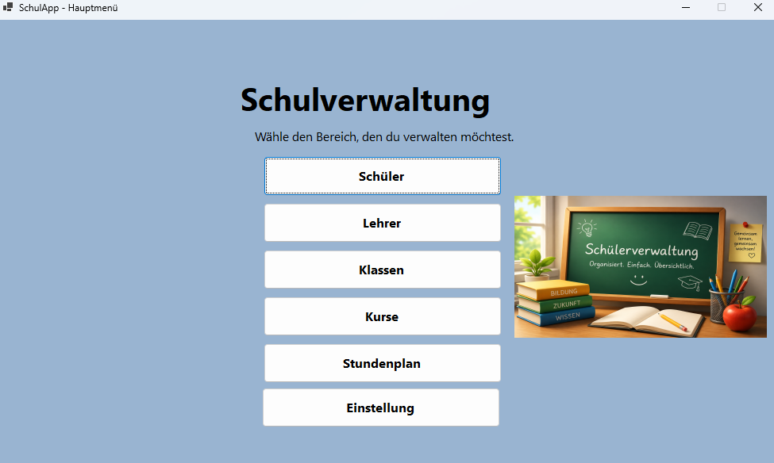

## Schüler

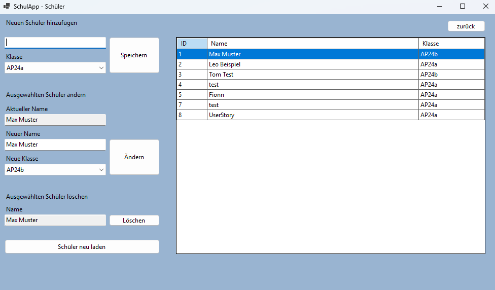

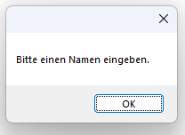

## Lehrer

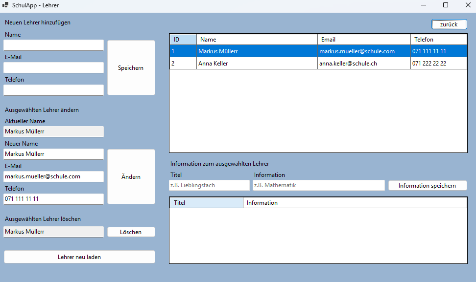

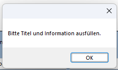

## Klassen

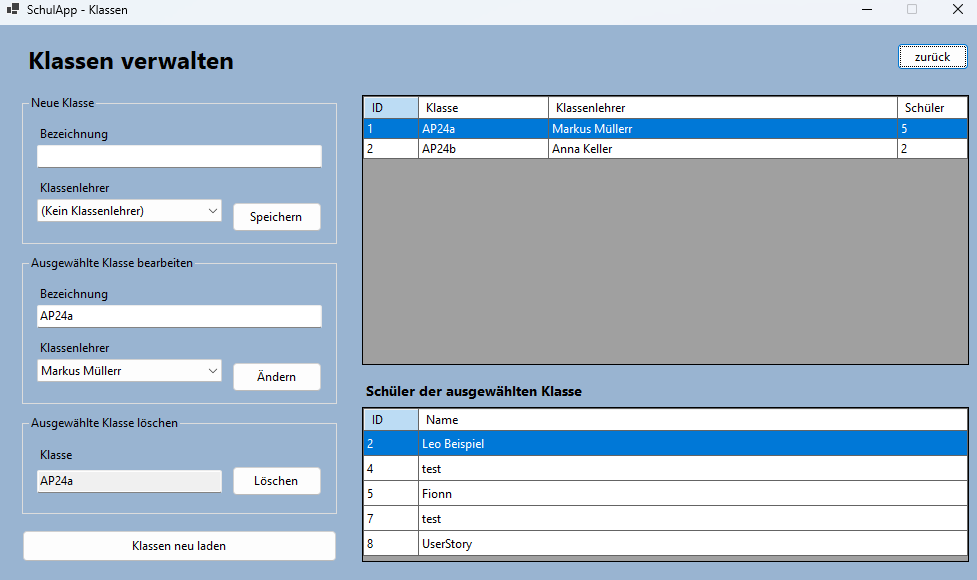

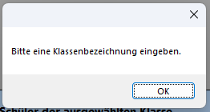

## Kurse

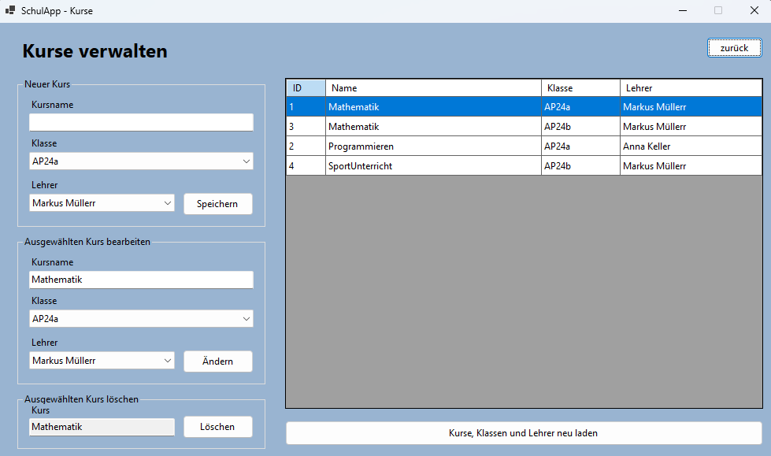

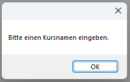

## Stundenplan

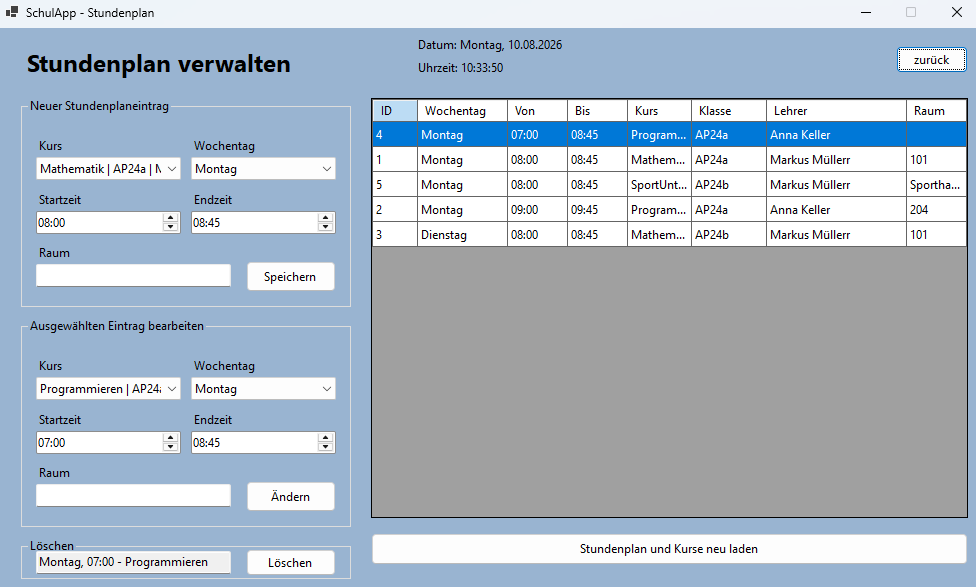

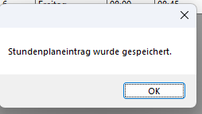

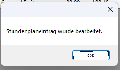

## Einstellungen
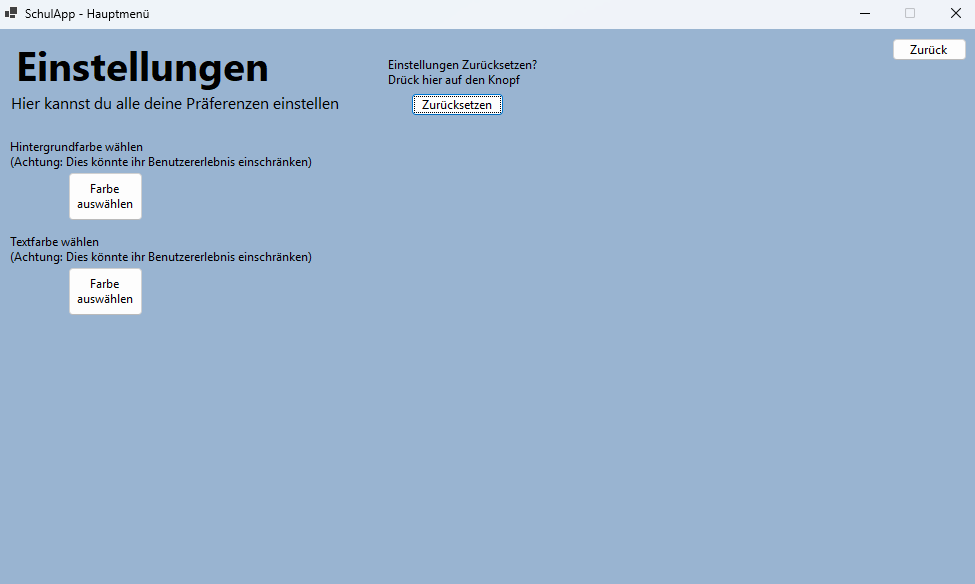

### Beispiel Einstellungen

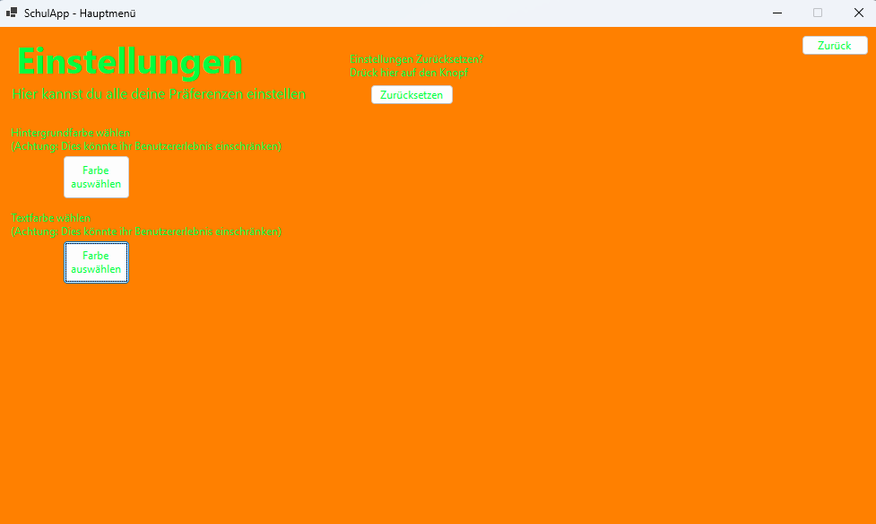

## Weitere Ansichten

### Loading Screen

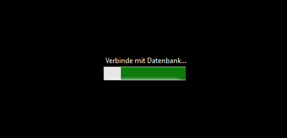

### Löschbestätigung

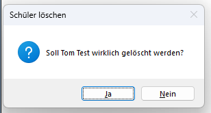

### Farbauswahl
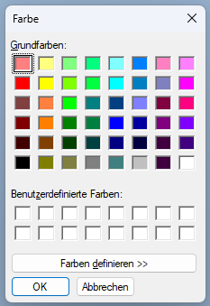
