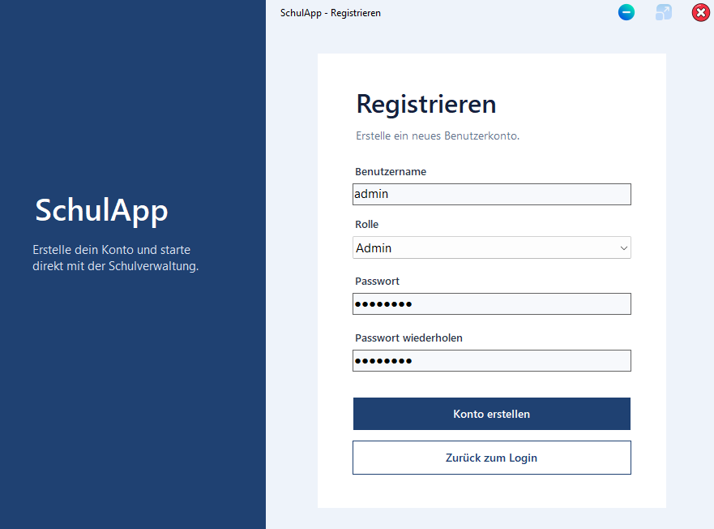
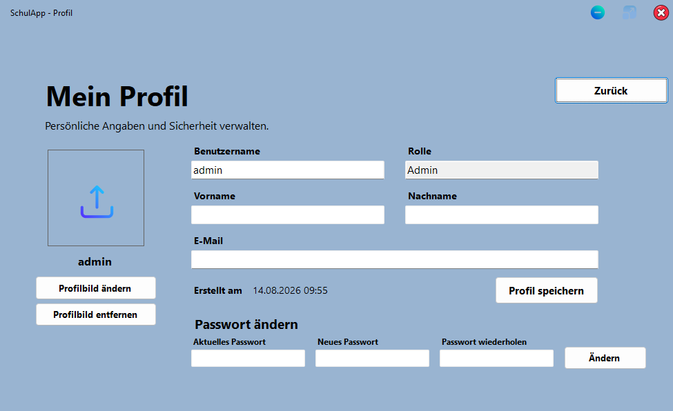
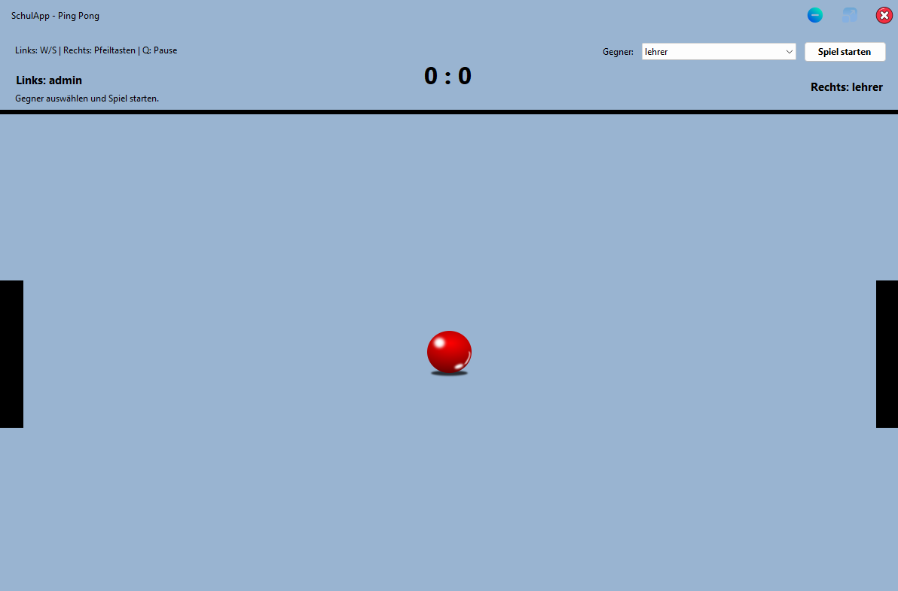
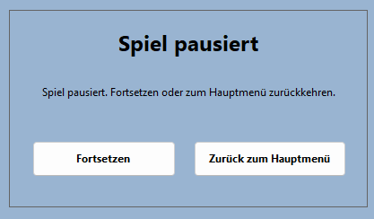
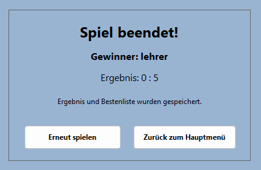
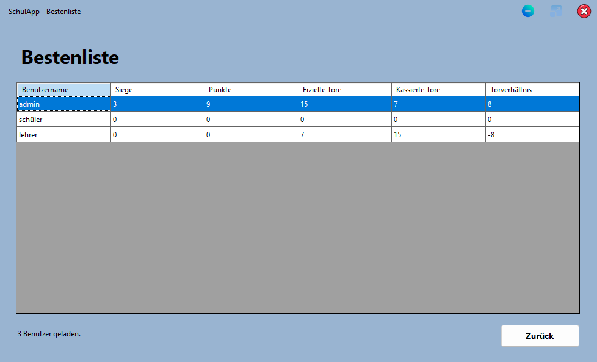

# SchulApp Screenshots

Diese Galerie zeigt die wichtigsten Oberflächen der SchulApp. Die Hauptanwendung wird mit C# und Windows Forms entwickelt und enthält Bereiche für Schulverwaltung, Benutzerprofile, Einstellungen, Stundenplan und PingPong.

Zur Projektübersicht: [`../README.md`](../README.md)

## Login und Registrierung

### Login

### Registrierung

## Hauptmenü

Das Hauptmenü passt verfügbare Bereiche anhand der Benutzerrolle an.

## Profil

## Schülerverwaltung

### Validierung

## Lehrerverwaltung

### Validierung

## Klassen

### Validierung

## Kurse

### Validierung

## Stundenplan

### Eintrag gespeichert

### Eintrag bearbeitet

## Einstellungen

### Beispiel für benutzerdefinierte Einstellungen

### Farbauswahl

## PingPong

### Spiel pausiert

### Spiel beendet

## Bestenliste

## Weitere Ansichten

### Loading Screen

### Löschbestätigung

## Noch nicht als eigener Screenshot vorhanden

Einige neuere Funktionen sind bereits im Code vorhanden, besitzen in diesem Ordner aber noch keinen eigenen Screenshot. Dazu gehören insbesondere:

- Audit Log
- CSV/PDF-Exportmenü
- Schüler-CSV-Import
- herunterladbare CSV-Importvorlage
- Prometheus- und Grafana-Dashboard

Die Galerie zeigt deshalb die vorhandenen UI-Aufnahmen, ohne fehlende Screenshots als bereits dokumentiert darzustellen.
